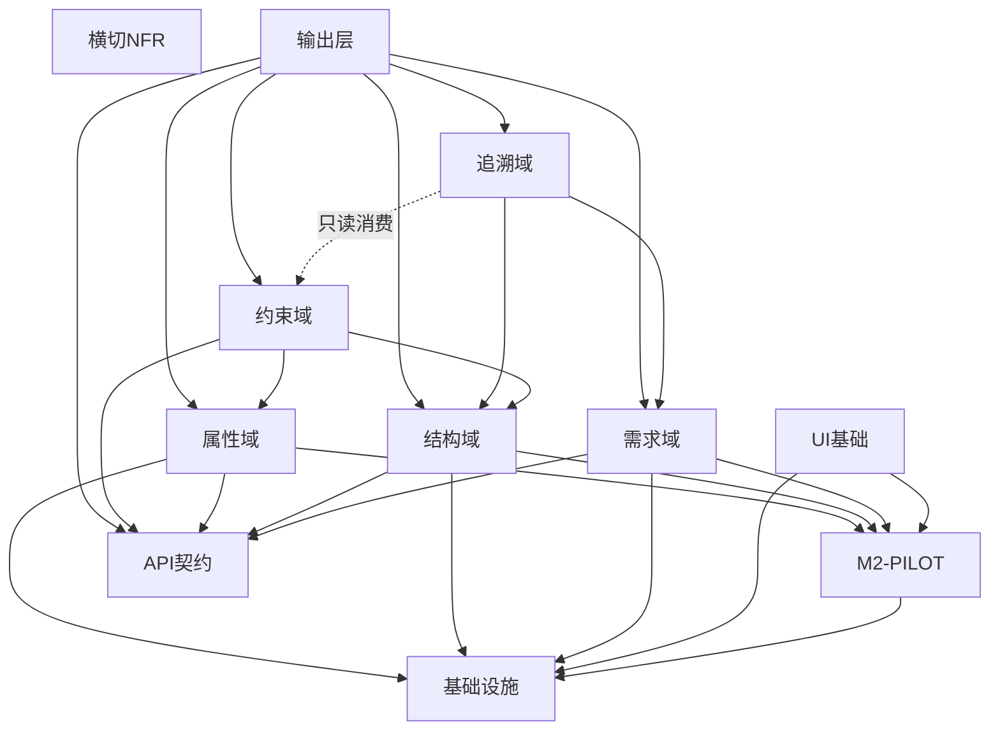

# SysML v2 建模平台架构蓝图 v3（MECE严格版）

版本：v3（与agile_traceability_matrix_v5_mece.yaml对齐）
更新：强化MECE原则，明确领域边界，消除循环依赖

## 1. 目标与设计原则

### 1.1 核心目标
- 以最小复杂度实现基于 SysML v2 的 Web 建模平台
- 保证标准合规、体验现代、易于扩展
- 严格执行MECE（Mutually Exclusive, Collectively Exhaustive）原则

### 1.2 设计原则
- **M2复用**：复用官方 sysml-v2-pilot 的元模型，本系统聚焦 M1（实例）层
- **职责单一**：每个领域仅负责自己的核心关注点，不越界
- **依赖无环**：严格DAG依赖，防止循环引用
- **契约先行**：GraphQL schema作为领域间协作契约
- **只读消费**：跨域数据消费采用只读模式，避免回写形成环

## 2. 技术栈与分层架构

### 2.1 技术栈（确定）
- **前端**：Sirius Web（React + GraphQL Client）
- **API层**：Spring Boot + GraphQL（Query/Mutation/Subscription）
- **模型层**：EMF + Lean CDO（单Repository，无分支/审计/锁）
- **持久化**：Dev=H2，Prod=PostgreSQL（CDO JDBC Store）
- **M2复用**：sysml-v2-pilot（KerML/SysML包、Adapter、Factory）

### 2.2 逻辑分层（MECE版）

```
┌─────────────────────────────────────────────────────┐
│                  表现层 (Sirius Web)                 │
│         树/表/图/表单视图 + GraphQL Client           │
└─────────────────────────────────────────────────────┘
                           ↓
┌─────────────────────────────────────────────────────┐
│                 API契约层 (GraphQL)                  │
│    骨架Schema + 领域模块增量挂载 + DataLoader        │
└─────────────────────────────────────────────────────┘
                           ↓
┌─────────────────────────────────────────────────────┐
│                    应用服务层                        │
│  ┌──────────┬──────────┬──────────┬──────────┐    │
│  │需求域    │结构域    │约束域    │追溯域    │    │
│  │(REQ)     │(STRUCT)  │(CONST)   │(TRACE)   │    │
│  └──────────┴──────────┴──────────┴──────────┘    │
│                    事务边界与编排                    │
└─────────────────────────────────────────────────────┘
                           ↓
┌─────────────────────────────────────────────────────┐
│              领域模型层 (EMF/CDO)                    │
│         M2类型系统 + M1实例存储 + 事务管理          │
└─────────────────────────────────────────────────────┘
                           ↓
┌─────────────────────────────────────────────────────┐
│                    基础设施层                        │
│        CDO仓库 + 事件总线 + 健康监控 + 日志         │
└─────────────────────────────────────────────────────┘
```

### 2.3 领域职责划分（MECE）

| 领域 | 职责范围 | 不负责 |
|------|---------|--------|
| **需求域(REQ)** | 需求CRUD、层次管理(derive/refine)、需求间关系、查询 | 跨域关系(satisfy/verify)、数值计算 |
| **结构域(STRUCT)** | Part/Port/Connection建模、拓扑合法性(方向/类型) | 数值约束、与需求的关系 |
| **属性域(PROP)** | 属性类型定义、单位/量纲、模板管理 | 计算、验证、关系 |
| **约束域(CONST)** | 公式求值、派生计算、阈值判定、结果记录 | 创建追溯关系、修改源对象 |
| **追溯域(TRACE)** | 跨域关系管理(satisfy/verify/allocate)、覆盖率分析 | 计算、回写源对象 |
| **输出层(OUTPUT)** | 事件订阅、报表生成、导入导出 | 领域逻辑、数据修改 |

## 3. 依赖关系（DAG）



关键规则：
- 实线箭头：直接依赖
- 虚线箭头：只读消费（不触发计算，不回写）
- 无环：任何节点都不能通过依赖链回到自己

## 4. 数据流与控制流

### 4.1 命令流（Mutation）
```
用户操作 → Sirius Web → GraphQL Mutation → 应用服务（事务边界）
    ↓
领域验证 → CDO写入 → 事务提交 → 事件发布
    ↓
GraphQL Subscription → 前端增量更新
```

### 4.2 查询流（Query）
```
前端请求 → GraphQL Query → DataLoader批量加载
    ↓
CDO读取 → DTO映射 → 响应返回
```

### 4.3 跨域协作模式

**案例：需求验证流程**
1. 需求域：创建需求，定义验收条件
2. 约束域：执行约束校验，生成验证结果（写入结果表）
3. 追溯域：读取验证结果，建立verify关系（不回写需求）
4. 输出层：生成覆盖率报表（只读聚合）

关键：验证状态作为"证据"存储在约束域或追溯域，不回写需求对象，避免循环依赖。

## 5. 阶段化实施路线

### Phase 0: Foundation
**目标**：技术基础就绪
- 建立CDO仓库（Lean配置）
- 注册M2模型（KerML/SysML）
- GraphQL骨架端点
- Sirius运行时绑定
- NFR最小集（健康/日志/错误码）

**退出标准**：
- `/health/*` 全部UP
- M2 round-trip测试通过
- GraphQL introspection可用

### Phase 1: 需求管理（P1）
**目标**：需求域最小闭环
- 需求CRUD + 层次管理
- 需求间关系（derive/refine）
- 查询与检索
- 需求树/表视图

**退出标准**：
- 中等数据集查询P50 < 200ms
- 层次无环验证有效
- GraphQL契约快照建立

### Phase 2: 结构与属性（P2）
**目标**：结构建模与参数管理
- Part/Port/Connection建模
- 拓扑合法性校验
- 属性类型与单位系统
- 结构图视图

**退出标准**：
- 50+组件流畅浏览
- 连接校验实时反馈
- 属性模板可复用

### Phase 3: 约束分析（P3）
**目标**：计算与验证
- Formula计算模块
- 派生值自动计算
- 阈值约束判定
- 计算结果存储（带provenance）

**退出标准**：
- 计算结果正确
- 审计追踪完整
- 性能满足要求

### Phase 4: 追溯管理（P4）
**目标**：跨域关系与覆盖率
- Satisfy/Verify/Allocate关系
- 覆盖率矩阵生成
- 验证证据收集（只读）

**退出标准**：
- 覆盖率矩阵P90 < 1500ms
- 关系查询双向可达
- 证据链完整

### Phase 5: 输出交付（P5）
**目标**：对外交付能力
- 模型变更订阅
- 验证/覆盖率报表
- 导入导出（往返等价）

**退出标准**：
- 订阅延迟P90 < 100ms
- 导入导出往返测试通过
- 报表格式符合要求

## 6. 关键设计决策

### 6.1 避免循环依赖的策略

1. **验证状态不回写**
   - ❌ 错误：需求对象包含验证状态字段，追溯域更新它
   - ✅ 正确：验证状态存储在独立的证据表，追溯域只读取

2. **覆盖率作为视图**
   - ❌ 错误：覆盖率百分比写回需求对象
   - ✅ 正确：覆盖率实时计算或缓存在报表域

3. **约束结果独立存储**
   - ❌ 错误：约束结果直接修改结构对象属性
   - ✅ 正确：约束结果存储在结果表，带时间戳和provenance

### 6.2 领域间协作原则

1. **契约先行**：每个领域先定义GraphQL schema模块
2. **事件驱动**：通过事件总线异步通知，避免直接调用
3. **只读消费**：跨域数据访问采用只读模式
4. **聚合视图**：复杂查询通过专门的聚合服务提供

### 6.3 性能优化策略

1. **DataLoader**：批量加载，消除N+1
2. **投影查询**：只查询需要的字段
3. **缓存策略**：热点数据内存缓存
4. **异步处理**：重计算任务异步执行

## 7. 部署架构

### 7.1 开发环境
```yaml
services:
  app:
    - Spring Boot (8080)
    - H2 Database (embedded)
    - Sirius Web (3000)
  监控:
    - Health checks
    - 日志输出到控制台
```

### 7.2 生产环境
```yaml
services:
  app:
    - Spring Boot集群 (多实例)
    - PostgreSQL (RDS)
    - CDO Server (单实例)
    - Sirius Web (CDN)
  监控:
    - Prometheus + Grafana
    - ELK Stack
    - 分布式追踪
```

## 8. 风险与缓解

| 风险 | 影响 | 缓解措施 |
|-----|------|---------|
| CDO单点故障 | 高 | 主备切换，定期备份 |
| 循环依赖引入 | 高 | CI依赖检查，架构评审 |
| 性能退化 | 中 | 性能基线测试，渐进式优化 |
| M2版本不兼容 | 中 | 版本锁定，充分测试 |

## 9. 目录结构（与MECE对齐）

```
server/
├── api/
│   ├── graphql/
│   │   ├── schema/          # 骨架schema
│   │   └── modules/         # 领域schema模块
│   │       ├── requirements.graphqls
│   │       ├── structure.graphqls
│   │       ├── constraint.graphqls
│   │       └── traceability.graphqls
│   └── resolver/            # GraphQL resolvers
├── domain/
│   ├── requirement/         # 需求域
│   ├── structure/          # 结构域
│   ├── property/           # 属性域
│   ├── constraint/         # 约束域
│   └── traceability/       # 追溯域
├── application/            # 应用服务（事务边界）
├── infrastructure/         # 基础设施
│   ├── cdo/
│   ├── event/
│   └── monitoring/
└── output/                # 输出层
    ├── subscription/
    ├── report/
    └── export/
```

## 10. 验收标准

### 10.1 架构合规性
- [ ] MECE原则：领域职责无重叠且完整覆盖
- [ ] 依赖无环：通过工具验证DAG特性
- [ ] 契约稳定：Schema快照测试通过

### 10.2 性能基线
- [ ] 查询：中等数据集P50 < 200ms
- [ ] 变更：中等数据集P50 < 400ms  
- [ ] 订阅：事件推送P90 < 100ms

### 10.3 质量指标
- [ ] 单元测试覆盖率 > 85%
- [ ] 集成测试覆盖率 > 70%
- [ ] 无循环依赖（架构测试）

---

本架构蓝图v3与需求矩阵v5（agile_traceability_matrix_v5_mece.yaml）完全对齐，确保设计与需求的一致性。后续实施严格遵循MECE原则和DAG依赖规则。