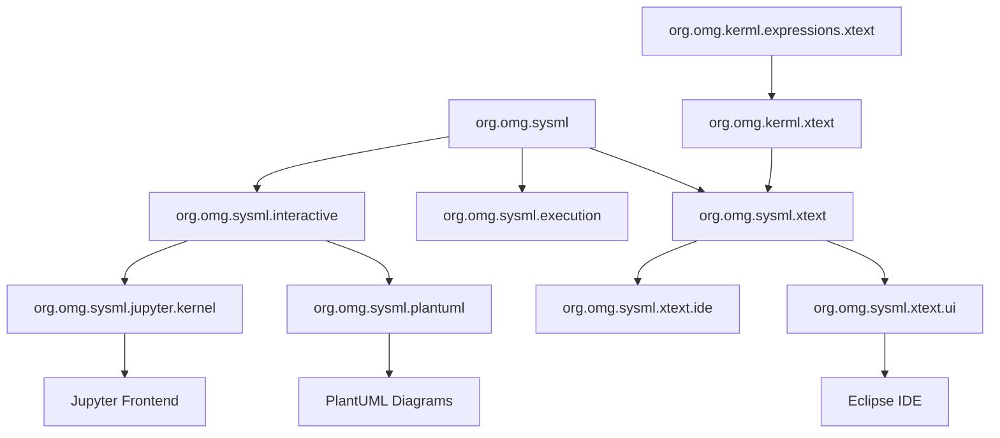
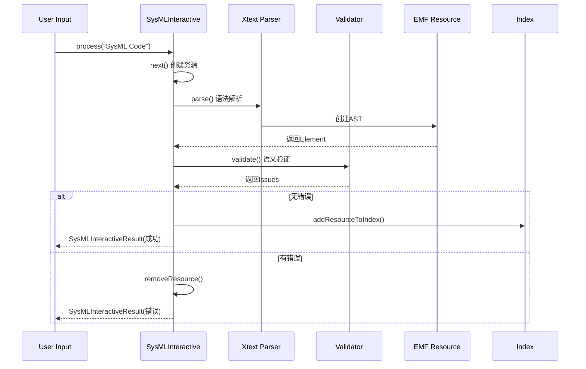
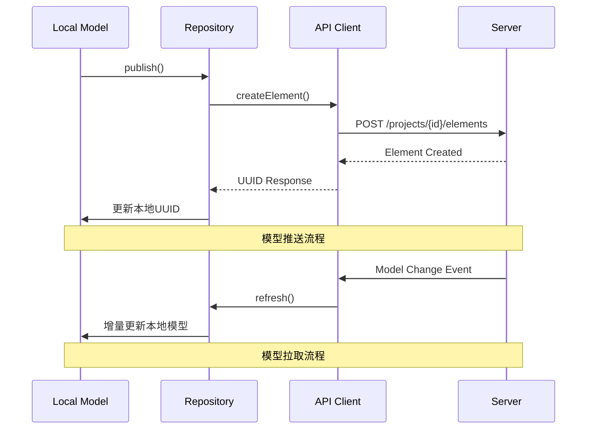
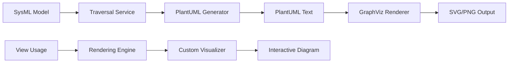
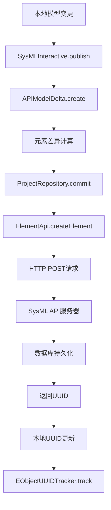
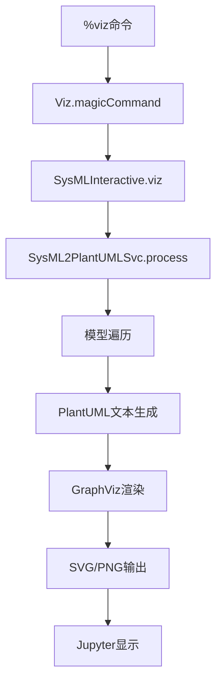

# SysML v2 Pilot Implementation 架构深度分析

## 📋 目录

- [1. 概述](#1-概述)
- [2. 版本兼容性分析](#2-版本兼容性分析)
- [3. 架构总览](#3-架构总览)
- [4. 核心服务层详解](#4-核心服务层详解)
- [5. 数据流转机制](#5-数据流转机制)
- [6. 操作方式详解](#6-操作方式详解)
- [7. 服务调用链路](#7-服务调用链路)
- [8. 关键接口和扩展点](#8-关键接口和扩展点)
- [9. 性能优化机制](#9-性能优化机制)
- [10. 部署和集成方案](#10-部署和集成方案)

---

## 1. 概述

SysML v2 Pilot Implementation 是 OMG 系统建模社区（SMC）开发的 SysML 2.0 概念验证实现，提供了完整的系统建模语言支持，包括文本编辑、图形化建模、模型执行和协作功能。

### 1.1 项目特点

- **标准合规**: 严格遵循 OMG SysML 2.0 规范
- **多前端支持**: 同时支持 Jupyter 和 Eclipse IDE
- **分布式协作**: 内置模型仓库和版本控制
- **可扩展架构**: 基于 Eclipse 插件和 Jupyter 魔法命令的扩展机制

---

## 2. 版本兼容性分析

### 2.1 核心版本信息

```xml
<!-- 项目统一版本 -->
<revision>0.51.0-SNAPSHOT</revision>

<!-- 技术栈版本 -->
<java.version>21</java.version>
<xtext.version>2.38.0</xtext.version>
<tycho-version>4.0.13</tycho-version>
```

### 2.2 元模型版本

```xml
<!-- SysML 元模型命名空间 -->
<nsURI>https://www.omg.org/spec/SysML/20250201</nsURI>
```

### 2.3 版本统一性保证

| 组件 | 版本管理方式 | 兼容性保证 |
|------|-------------|-----------|
| **核心元模型** | 统一父POM `${revision}` | ✅ 版本锁定 |
| **服务层** | 统一父POM `${revision}` | ✅ 版本锁定 |
| **交互层** | 统一父POM `${revision}` | ✅ 版本锁定 |
| **API客户端** | 内嵌JAR `sysml-v2-api-client-all.jar` | ✅ 版本绑定 |

**结论**: 服务和元模型版本完全统一，确保调用兼容性。

---

## 3. 架构总览

### 3.1 分层架构

```
┌─────────────────────────────────────────────────────────────┐
│                    前端表示层                                │
│  ┌─────────────┐  ┌──────────────┐  ┌─────────────────────┐ │
│  │ Jupyter     │  │ Eclipse IDE  │  │ Web API             │ │
│  │ Notebook    │  │ + PlantUML   │  │ (REST/GraphQL)      │ │
│  └─────────────┘  └──────────────┘  └─────────────────────┘ │
└─────────────────────┬───────────────────────────────────────┘
                      │ 前端适配器
┌─────────────────────┴───────────────────────────────────────┐
│                  交互服务层                                  │
│  ┌─────────────┐  ┌──────────────┐  ┌─────────────────────┐ │
│  │ SysML       │  │ Magic        │  │ 可视化服务          │ │
│  │ Interactive │  │ Commands     │  │ (PlantUML/Viz)      │ │
│  └─────────────┘  └──────────────┘  └─────────────────────┘ │
└─────────────────────┬───────────────────────────────────────┘
                      │ 服务API
┌─────────────────────┴───────────────────────────────────────┐
│                   核心服务层                                │
│  ┌─────────────┐  ┌──────────────┐  ┌─────────────────────┐ │
│  │ 语言服务    │  │ 执行引擎     │  │ 仓库管理            │ │
│  │ (Xtext)     │  │ (Expression) │  │ (Repository)        │ │
│  └─────────────┘  └──────────────┘  └─────────────────────┘ │
└─────────────────────┬───────────────────────────────────────┘
                      │ 模型访问
┌─────────────────────┴───────────────────────────────────────┐
│                    模型层                                   │
│  ┌─────────────┐  ┌──────────────┐  ┌─────────────────────┐ │
│  │ SysML       │  │ KerML        │  │ EMF Runtime         │ │
│  │ 元模型      │  │ 元模型       │  │ (Resource Set)      │ │
│  └─────────────┘  └──────────────┘  └─────────────────────┘ │
└─────────────────────────────────────────────────────────────┘
```

### 3.2 模块依赖关系



---

## 4. 核心服务层详解

### 4.1 交互服务核心 (SysMLInteractive)

#### 主要职责
```java
public class SysMLInteractive extends SysMLUtil {
    // 核心功能模块
    private Resource resource;                    // 当前模型资源
    private Traversal traversal;                  // 模型遍历器
    private SysML2PlantUMLSvc sysml2PlantUMLSvc; // 可视化服务
    private EObjectUUIDTracker tracker;          // UUID跟踪器
    
    // 依赖注入服务
    @Inject private IGlobalScopeProvider scopeProvider;
    @Inject private KerMLQualifiedNameConverter qualifiedNameConverter;
    @Inject private IResourceValidator validator;
    @Inject private ILibraryIndexProvider libraryIndexCache;
}
```

#### 核心服务方法
| 方法 | 功能 | 返回类型 |
|------|------|----------|
| `process(String input)` | 解析和验证SysML代码 | `SysMLInteractiveResult` |
| `resolve(String name)` | 解析元素引用 | `Element` |
| `loadLibrary(String path)` | 加载模型库 | `void` |
| `validate()` | 模型验证 | `List<Issue>` |

### 4.2 仓库管理服务

#### ProjectRepository 架构
```java
public class ProjectRepository {
    private final String repositoryURL;
    private final ApiClient apiClient;
    private final ProjectApi projectApi;
    private final BranchApi branchApi;
    private final CommitApi commitApi;
    private final QueryApi queryApi;
    private final ElementApi elementApi;
    
    // 核心功能
    public Project createProject(String name);
    public List<Project> getProjects();
    public Branch createBranch(String projectId, String name);
    public Commit commit(String projectId, String branchId, List<Element> elements);
}
```

#### API模型管理
```java
public class APIModel {
    private Map<UUID, Element> modelElements;  // 所有模型元素
    private Map<UUID, Element> modelRoots;     // 根级元素
    
    // 扁平化模型管理
    public void addModelRoot(UUID id, Element rootElement);
    public void addModelElement(UUID id, Element modelElement);
    public Map<UUID, Element> getModelElements();
}
```

### 4.3 语言服务层 (Xtext集成)

#### 语言服务架构
```
org.omg.kerml.expressions.xtext/     # KerML表达式语法
├── grammar/                         # 语法定义
├── validation/                      # 语义验证
└── scoping/                        # 作用域解析

org.omg.kerml.xtext/               # KerML核心语法  
├── grammar/                        # 语法定义
├── validation/                     # 语义验证
└── scoping/                       # 作用域解析

org.omg.sysml.xtext/              # SysML语法扩展
├── grammar/                        # 基于KerML的扩展语法
├── validation/                     # SysML特定验证
└── scoping/                       # 作用域解析
```

#### IDE集成服务
| 模块 | 功能 | 支持特性 |
|------|------|----------|
| `*.xtext.ide` | LSP服务 | 代码提示、错误检查、重构 |
| `*.xtext.ui` | Eclipse UI | 编辑器、视图、向导 |

### 4.4 执行引擎服务

#### 表达式求值器
```java
public class ExpressionEvaluator {
    // 核心求值方法
    public Object evaluate(Expression expression, Element context);
    
    // 支持的表达式类型
    - LiteralExpression (字面量)
    - FeatureReferenceExpression (特征引用)
    - OperatorExpression (操作符)
    - InvocationExpression (调用)
}
```

---

## 5. 数据流转机制

### 5.1 模型解析流程



### 5.2 仓库同步流程



### 5.3 可视化数据流



---

## 6. 操作方式详解

### 6.1 Jupyter Notebook 操作

#### 魔法命令体系
```python
# 帮助命令
%help                    # 显示所有命令帮助
%help show              # 显示特定命令帮助

# 模型管理
%projects               # 列出所有项目  
%load <project>         # 加载项目
%save <name>           # 保存当前模型

# 可视化命令
%viz <element>          # 生成PlantUML图
%show <element>         # 显示元素详情
%view <element>         # 自定义视图渲染

# 协作命令  
%publish <project>      # 发布到仓库
%repo <url>            # 设置仓库地址
%export <format>       # 导出模型

# 开发辅助
%eval <expression>     # 表达式求值
%listing              # 列出当前作用域元素
```

#### 完整操作示例
```python
# 1. 连接到模型仓库
%repo http://localhost:9000

# 2. 创建新项目
%projects create "Vehicle System"

# 3. 定义需求
requirement def VehicleSpeedRequirement {
    text "Vehicle shall achieve max speed of 200 km/h"
}

# 4. 定义系统架构
part def Vehicle {
    part engine : Engine;
    part transmission : Transmission;
    port fuelInput : FuelPort;
}

# 5. 可视化模型
%viz Vehicle

# 6. 验证和发布
%show Vehicle
%publish "Vehicle System"
```

### 6.2 Eclipse IDE 操作

#### 项目创建流程
1. **新建项目**: File → New → Project → SysML Project
2. **配置引用**: 项目属性 → Project References → 勾选 `sysml.library`
3. **转换项目**: 右键项目 → Configure → Convert to Xtext Project
4. **创建模型**: 新建 `.sysml` 文件开始建模

#### IDE功能特性
| 功能 | 快捷键 | 说明 |
|------|--------|------|
| **代码提示** | `Ctrl+Space` | 基于语法和语义的智能补全 |
| **语法检查** | 实时 | 红色波浪线标识语法错误 |
| **语义验证** | 实时 | 黄色警告标识语义问题 |
| **元素导航** | `F3` | 跳转到元素定义 |
| **引用查找** | `Ctrl+Shift+G` | 查找元素的所有引用 |
| **重构支持** | `Alt+Shift+R` | 重命名元素及其所有引用 |

### 6.3 API 操作方式

#### REST API 调用
```bash
# 获取项目列表
curl -X GET http://localhost:9000/projects

# 创建新项目
curl -X POST http://localhost:9000/projects \
  -H "Content-Type: application/json" \
  -d '{"name": "Vehicle System", "description": "Vehicle modeling project"}'

# 获取项目元素
curl -X GET http://localhost:9000/projects/{projectId}/elements

# 创建元素
curl -X POST http://localhost:9000/projects/{projectId}/elements \
  -H "Content-Type: application/json" \
  -d '{"@type": "PartDefinition", "name": "Vehicle", ...}'
```

#### Java API 调用
```java
// 创建仓库连接
ProjectRepository repo = new ProjectRepository("http://localhost:9000");

// 创建项目
Project project = repo.createProject("Vehicle System");

// 创建分支
Branch mainBranch = repo.createBranch(project.getId(), "main");

// 提交元素
List<Element> elements = Arrays.asList(vehicleElement);
Commit commit = repo.commit(project.getId(), mainBranch.getId(), elements);
```

---

## 7. 服务调用链路

### 7.1 模型创建调用链

```mermaid
graph TD
    A[用户输入SysML代码] --> B[SysMLInteractive.process]
    B --> C[next() 创建Resource]
    C --> D[XtextResource.parse]
    D --> E[语法解析器]
    E --> F[AST构建]
    F --> G[EMF模型创建]
    G --> H[IResourceValidator.validate]
    H --> I[语义验证规则]
    I --> J{验证结果}
    J -->|成功| K[addResourceToIndex]
    J -->|失败| L[removeResource]
    K --> M[返回成功结果]
    L --> N[返回错误结果]
```

### 7.2 仓库同步调用链



### 7.3 可视化生成调用链



---

## 8. 关键接口和扩展点

### 8.1 核心服务接口

#### 语言服务接口
```java
public interface IGlobalScopeProvider {
    IScope getScope(Resource context, EReference reference, Predicate<IEObjectDescription> filter);
}

public interface IResourceValidator {
    List<Issue> validate(Resource resource, CheckMode mode, CancelIndicator indicator);
}

public interface ILibraryIndexProvider {
    ResourceDescriptionsData getResourceDescriptions();
}
```

#### 魔法命令扩展接口
```java
public interface IMagicCommandRegistrator {
    void registerMagicCommand(Magics magics);
}

// 实现示例
@LineMagic
public static String customCommand(List<String> args) {
    // 自定义命令逻辑
    return result;
}
```

### 8.2 模型访问接口

#### 元素遍历接口
```java
public class Traversal {
    public void traverse(Element root, ElementVisitor visitor);
}

public interface ElementVisitor {
    void visit(Element element);
}
```

#### 仓库访问接口
```java
public interface ModelRepository {
    void save(Element element);
    Element load(UUID elementId);
    List<Element> query(String query);
}
```

### 8.3 可视化扩展点

#### 自定义渲染器
```java
public interface RenderingProvider {
    boolean canRender(Element element);
    String render(Element element, Map<String, Object> options);
}

// PlantUML渲染器实现
public class SysML2PlantUMLProvider implements RenderingProvider {
    @Override
    public boolean canRender(Element element) {
        return element instanceof Type || element instanceof Usage;
    }
    
    @Override
    public String render(Element element, Map<String, Object> options) {
        // 生成PlantUML文本
    }
}
```

---

## 9. 性能优化机制

### 9.1 解析优化

#### 增量解析机制
```java
public class XtextResource {
    // 支持增量重解析
    public void reparse(String input);
    
    // 缓存解析结果
    private IParseResult parseResult;
    private ResourceDescriptionsData index;
}
```

#### 索引缓存机制
```java
public class StrictShadowingResourceDescriptionData extends ResourceDescriptionsData {
    // 严格的作用域遮蔽规则
    // 提高元素解析性能
}
```

### 9.2 内存优化

#### 懒加载机制
```java
public class LazyLoadingResource implements Resource {
    // 延迟加载模型内容
    // 减少内存占用
}
```

#### 资源池化
```java
public class ResourcePool {
    private Queue<Resource> availableResources;
    
    public Resource acquire();
    public void release(Resource resource);
}
```

### 9.3 网络优化

#### API客户端优化
```java
public class ApiClient {
    private OkHttpClient httpClient = new OkHttpClient.Builder()
        .connectTimeout(1, TimeUnit.HOURS)     // 长连接
        .readTimeout(1, TimeUnit.HOURS)        // 读取超时
        .writeTimeout(1, TimeUnit.HOURS)       // 写入超时
        .addInterceptor(new PagerInterceptor()) // 分页拦截器
        .build();
}
```

#### 批量操作支持
```java
public class BatchOperations {
    // 批量创建元素
    public List<Element> createElements(List<Element> elements);
    
    // 批量更新元素
    public List<Element> updateElements(List<Element> elements);
}
```

---

## 10. 部署和集成方案

### 10.1 Jupyter 部署

#### 内核安装
```bash
# 1. 构建项目
mvn clean package

# 2. 安装内核
cd org.omg.sysml.jupyter.kernel
./installKernel.sh

# 3. 启动Jupyter
jupyter lab
```

#### 环境变量配置
```bash
export SYSML_LIBRARY_PATH="/path/to/sysml.library"
export SYSML_API_BASE_PATH="http://localhost:9000"
export SYSML_GRAPHVIZ_PATH="/usr/bin/dot"
```

### 10.2 Eclipse 部署

#### P2 更新站点
```xml
<!-- feature.xml -->
<feature id="org.omg.sysml.feature" version="0.51.0.qualifier">
   <plugin id="org.omg.sysml" version="0.51.0.qualifier"/>
   <plugin id="org.omg.sysml.interactive" version="0.51.0.qualifier"/>
   <plugin id="org.omg.sysml.xtext.ui" version="0.51.0.qualifier"/>
</feature>
```

#### Tycho 构建配置
```xml
<plugin>
    <groupId>org.eclipse.tycho</groupId>
    <artifactId>tycho-maven-plugin</artifactId>
    <version>4.0.13</version>
    <extensions>true</extensions>
</plugin>
```

### 10.3 API服务器集成

#### Docker 部署
```dockerfile
FROM openjdk:21-jdk-slim

COPY sysml-api-server.jar /app/
COPY sysml.library/ /app/library/

EXPOSE 9000
CMD ["java", "-jar", "/app/sysml-api-server.jar"]
```

#### 配置文件
```yaml
# application.yml
server:
  port: 9000
  
sysml:
  library:
    path: "/app/library"
  repository:
    type: "postgresql"
    url: "jdbc:postgresql://localhost:5432/sysml"
```

---

## 🎯 总结

### 核心优势
1. **版本统一**: 服务层和元模型完全版本同步，确保调用兼容性
2. **标准合规**: 严格遵循OMG SysML 2.0规范，保证互操作性
3. **架构清晰**: 分层设计，职责明确，易于维护和扩展
4. **多前端支持**: 同时支持Jupyter和Eclipse，满足不同用户需求
5. **协作能力**: 内置分布式仓库管理，支持团队协作

### 调用兼容性保证
- ✅ **元模型版本**: `https://www.omg.org/spec/SysML/20250201`
- ✅ **服务版本**: `0.51.0-SNAPSHOT` (统一父POM管理)
- ✅ **API兼容**: 内嵌API客户端JAR，版本绑定
- ✅ **依赖管理**: Tycho+Maven确保依赖一致性

### 扩展建议
1. **自定义魔法命令**: 实现`IMagicCommandRegistrator`接口
2. **可视化扩展**: 实现`RenderingProvider`接口
3. **验证规则扩展**: 继承Xtext验证框架
4. **仓库适配器**: 实现自定义存储后端

SysML v2 Pilot Implementation 提供了一个完整、可扩展的系统建模平台，为MBSE实践提供了强大的技术基础。 