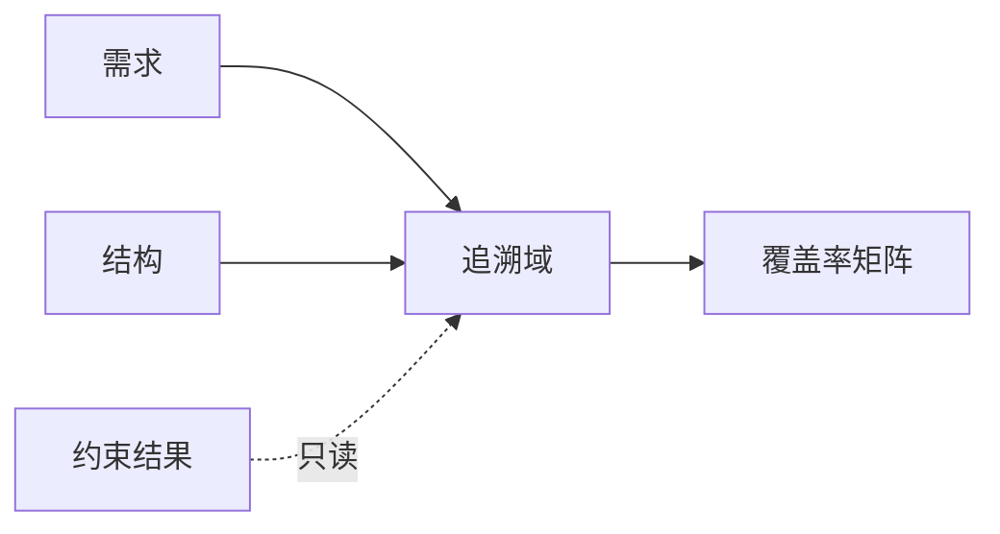
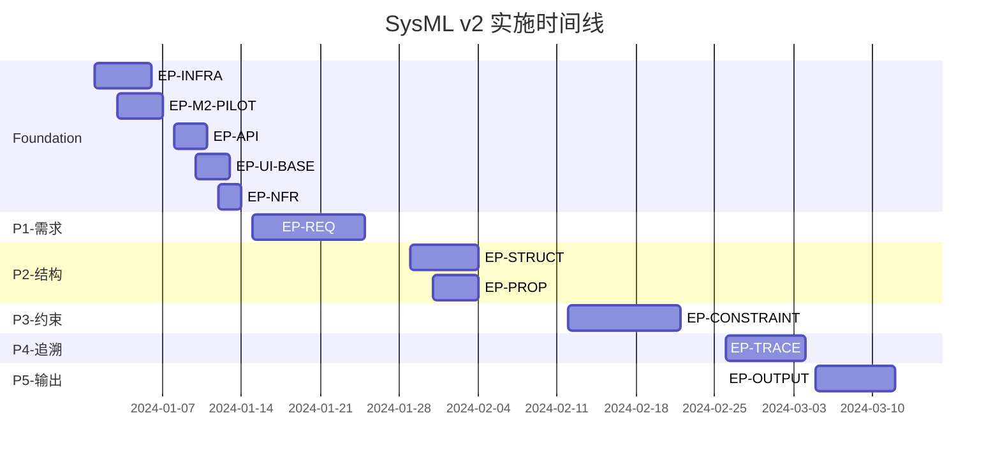

# SysML v2 建模平台实施计划

版本：v1.0  
基准文档：
- Architecture_v3.md（架构设计）
- agile_traceability_matrix_v5_mece.yaml（需求矩阵）

## 1. 执行摘要

### 1.1 项目概述
构建基于SysML v2标准的Web建模平台，采用EMF/CDO + GraphQL + Sirius Web技术栈，严格遵循MECE原则和DAG依赖管理。

### 1.2 实施策略
- **分阶段交付**：6个阶段（Foundation + P1-P5），每阶段2-3周
- **增量式开发**：每个阶段产出可工作软件
- **风险前置**：Foundation阶段验证技术可行性
- **契约驱动**：GraphQL schema先行，测试驱动开发

### 1.3 关键里程碑
- **M0**（第3周）：Foundation完成，技术栈验证
- **M1**（第6周）：P1需求管理上线
- **M2**（第9周）：P2结构建模可用
- **M3**（第12周）：P3约束分析运行
- **M4**（第14周）：P4追溯完整
- **M5**（第16周）：P5全功能交付

## 2. 团队组织

### 2.1 团队结构
```
项目经理（1人）
├── 技术负责人（1人）
├── 开发团队（4-5人）
│   ├── 后端开发（2人）- EMF/CDO/GraphQL
│   ├── 前端开发（1人）- Sirius Web
│   ├── 全栈开发（1-2人）- 领域功能
├── QA工程师（1人）
└── DevOps工程师（0.5人）
```

### 2.2 角色职责

| 角色 | 职责 | 技能要求 |
|------|------|---------|
| 技术负责人 | 架构决策、技术选型、代码评审 | EMF/CDO经验、GraphQL、系统架构 |
| 后端开发A | Foundation层、需求域、追溯域 | Spring Boot、GraphQL、事务管理 |
| 后端开发B | 结构域、约束域、属性域 | EMF建模、计算引擎、验证规则 |
| 前端开发 | Sirius视图配置、UI集成 | React、GraphQL Client、Sirius Web |
| QA工程师 | 测试策略、自动化测试、性能测试 | JUnit、GraphQL测试、JMeter |

## 3. 阶段化实施计划

### Phase 0: Foundation（第1-3周）

#### 目标
建立技术基础设施，验证核心技术栈可行性

#### Epic分解
| Epic | Story数 | 工作量 | 负责人 |
|------|---------|--------|--------|
| EP-INFRA | 2 | 5天 | 后端A |
| EP-M2-PILOT | 2 | 4天 | 后端B |
| EP-API | 3 | 3天 | 后端A |
| EP-UI-BASE | 2 | 3天 | 前端 |
| EP-NFR | 3 | 2天 | 全栈 |

#### 关键交付物
- [x] CDO仓库启动并通过健康检查
- [x] M2模型注册，round-trip验证通过
- [x] GraphQL端点可访问，支持introspection
- [x] Sirius运行时绑定成功
- [x] 基础监控和日志就位

#### 验收标准
```bash
# 健康检查
curl http://localhost:8080/health
# 返回：{"status":"UP","components":{"cdo":"UP","graphql":"UP","sirius":"UP"}}

# GraphQL探活
curl -X POST http://localhost:8080/graphql \
  -H "Content-Type: application/json" \
  -d '{"query":"{ ok }"}'
# 返回：{"data":{"ok":true}}

# M2验证
./gradlew test --tests "*RoundTripTest"
# 全部通过
```

#### 风险与缓解
| 风险 | 概率 | 影响 | 缓解措施 |
|------|------|------|---------|
| CDO集成复杂 | 高 | 高 | 提前POC，准备替代方案 |
| Sirius学习曲线 | 中 | 中 | 团队培训，专家支持 |

### Phase 1: 需求管理（第4-6周）

#### 目标
实现需求域核心功能，建立第一个端到端流程

#### Epic：EP-REQ
| Story | 工作量 | 依赖 | 交付物 |
|-------|--------|------|--------|
| US-REQ-API-000 | 0.5天 | - | requirements.graphqls |
| US-REQ-001 | 2天 | API | 需求CRUD功能 |
| US-REQ-002 | 1.5天 | 001 | 层次管理+环检测 |
| US-REQ-003 | 1天 | 001 | 查询优化+DataLoader |
| US-REQ-004 | 1天 | 002 | 需求间关系 |
| US-REQ-005 | 1.5天 | UI-BASE | Sirius视图 |

#### 测试计划
```yaml
单元测试:
  - RequirementValidatorTest: 环检测、唯一性验证
  - RequirementUseCaseTest: CRUD逻辑、事务
  覆盖率: > 85%

集成测试:
  - RequirementGraphQLIT: API契约测试
  - RequirementPerformanceIT: 中等数据集P50<200ms
  覆盖率: > 70%

E2E测试:
  - RequirementTreeE2E: 树视图拖拽
  - RequirementTableE2E: 表格编辑
```

#### 性能基准
```javascript
// 性能测试脚本
const testCases = [
  { name: "查询100条", data: "small", target: 100 },
  { name: "查询1000条", data: "medium", target: 200 },
  { name: "创建需求", data: "small", target: 200 }
];
```

### Phase 2: 结构与属性（第7-9周）

#### 目标
结构建模能力，属性系统，不依赖需求域

#### Epic分解
| Epic | 并行度 | 工作量 | 交付顺序 |
|------|--------|--------|----------|
| EP-STRUCT | 可并行 | 6天 | 1 |
| EP-PROP | 可并行 | 4天 | 2 |

#### 关键设计
```java
// 拓扑校验（STRUCT内部）
public class ConnectionValidator {
    public ValidationResult validate(Port source, Port target) {
        // 仅检查方向和类型匹配
        if (!isDirectionValid(source, target)) {
            return ValidationResult.error("CONNECTION_INVALID");
        }
        if (!isTypeCompatible(source, target)) {
            return ValidationResult.error("PORT_TYPE_MISMATCH");
        }
        return ValidationResult.ok();
    }
}

// 属性定义（PROP独立）
public class PropertyTemplate {
    private String name;
    private PropertyType type;
    private Unit unit;
    // 不包含计算逻辑
}
```

### Phase 3: 约束分析（第10-12周）

#### 目标
计算引擎，约束验证，结果独立存储

#### Epic：EP-CONSTRAINT
| Story | 复杂度 | 关键技术 |
|-------|--------|----------|
| US-CONST-001 | 高 | 表达式解析器 |
| US-CONST-002 | 中 | 异步计算 |
| US-CONST-003 | 中 | 结果存储 |

#### 架构要点
```yaml
计算流程:
  1. 触发: 属性变更事件
  2. 排队: 计算任务队列
  3. 执行: Formula引擎（异步）
  4. 存储: 结果表（带provenance）
  5. 通知: 事件发布（不回写源）

存储设计:
  constraint_results:
    - id: UUID
    - source_id: 源对象ID
    - constraint_id: 约束ID
    - result: 计算结果
    - status: PASS/FAIL
    - timestamp: 时间戳
    - provenance: {formula, inputs, version}
```

### Phase 4: 追溯管理（第13-14周）

#### 目标
跨域关系管理，覆盖率分析，只读消费

#### Epic：EP-TRACE


#### 关键实现
```graphql
# 追溯域GraphQL
type TraceRelation {
  id: ID!
  type: TraceType! # SATISFY/VERIFY/ALLOCATE
  source: Element!
  target: Element!
  evidence: [Evidence!] # 只读引用约束结果
  createdAt: DateTime!
}

type Coverage {
  requirement: Requirement!
  satisfied: Boolean!
  verified: Boolean!
  evidence: [Evidence!]
  # 注意：不包含percentage等计算字段写回
}
```

### Phase 5: 输出交付（第15-16周）

#### 目标
事件订阅、报表、导入导出

#### Epic：EP-OUTPUT
| Story | 优先级 | 技术点 |
|-------|--------|--------|
| US-OUTPUT-001 | 高 | WebSocket/SSE |
| US-OUTPUT-002 | 中 | 报表模板引擎 |
| US-OUTPUT-003 | 中 | XMI/JSON序列化 |
| US-OUTPUT-004 | 高 | 导入解析器 |

## 4. 质量保障计划

### 4.1 测试策略

#### 测试金字塔
```
        E2E (10%)
      集成测试 (30%)
    单元测试 (60%)
```

#### 测试自动化
```yaml
CI Pipeline:
  - stage: build
    script: ./gradlew build
  
  - stage: unit-test
    script: ./gradlew test
    coverage: 85%
  
  - stage: integration-test
    script: ./gradlew integrationTest
    coverage: 70%
  
  - stage: contract-test
    script: ./gradlew contractTest
    
  - stage: performance-test
    script: ./gradlew jmh
    when: nightly
```

### 4.2 代码质量

#### 质量门禁
- 代码覆盖率 > 80%
- 圈复杂度 < 10
- 技术债务 < 5天
- 零Critical/Blocker问题

#### 代码评审
- 每个PR至少1人评审
- 架构变更需技术负责人评审
- 契约变更需全组评审

### 4.3 性能监控

#### 性能指标
| 指标 | 目标 | 监控方式 |
|------|------|---------|
| API响应时间 | P50<200ms | Prometheus |
| 错误率 | <1% | Grafana |
| 并发用户 | 50+ | JMeter |
| 内存使用 | <2GB | JVM Metrics |

## 5. 风险管理

### 5.1 技术风险

| 风险 | 概率 | 影响 | 缓解措施 | 责任人 |
|------|------|------|---------|--------|
| EMF/CDO学习成本高 | 高 | 高 | 培训、POC、专家支持 | 技术负责人 |
| Sirius Web定制受限 | 中 | 高 | 评估替代方案、原型验证 | 前端开发 |
| 性能不达标 | 中 | 高 | 早期性能测试、优化预留 | QA |
| M2版本兼容性 | 低 | 高 | 版本锁定、回归测试 | 后端B |

### 5.2 项目风险

| 风险 | 缓解措施 |
|------|---------|
| 需求变更 | 契约先行、快速迭代 |
| 资源不足 | 优先级管理、外部支持 |
| 集成复杂 | 接口mock、并行开发 |

## 6. 沟通计划

### 6.1 会议安排
- **每日站会**：15分钟，同步进度
- **周迭代评审**：展示本周成果
- **双周回顾**：流程改进
- **月度指导委员会**：汇报进展

### 6.2 文档管理
- **代码仓库**：Git + PR流程
- **文档仓库**：Markdown + 版本控制
- **知识库**：Confluence/Wiki
- **问题跟踪**：JIRA/GitHub Issues

## 7. 成功标准

### 7.1 功能完整性
- [ ] 6个阶段全部交付
- [ ] 所有Epic验收通过
- [ ] 端到端流程可用

### 7.2 质量标准
- [ ] 零Critical缺陷
- [ ] 测试覆盖率达标
- [ ] 性能指标满足

### 7.3 架构合规
- [ ] MECE原则验证
- [ ] 无循环依赖
- [ ] 契约稳定性

## 8. 时间线总览



## 9. 预算估算

### 9.1 人力成本
- 开发团队：6人 × 16周 = 96人周
- 按平均 2万/人月：约77万

### 9.2 基础设施
- 开发环境：云服务器 3台 × 4月 = 1.2万
- 生产环境：预留5万
- 工具许可：2万

### 9.3 总预算
约85万人民币

## 10. 启动检查清单

### 前置条件
- [ ] 团队到位
- [ ] 开发环境准备
- [ ] 代码仓库建立
- [ ] CI/CD流水线
- [ ] 基础培训完成

### 第一周目标
- [ ] Foundation Epic启动
- [ ] 日站会机制运行
- [ ] 第一个PR合并
- [ ] 健康检查通过

---

本实施计划基于Architecture_v3.md和agile_traceability_matrix_v5_mece.yaml制定，确保架构、需求、实施的一致性。计划将根据实际进展动态调整。