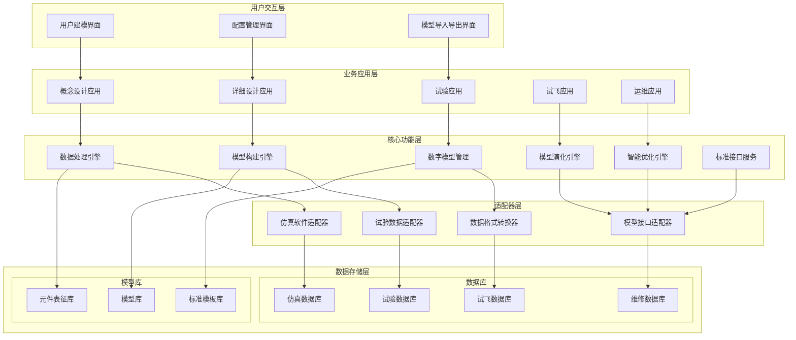

# 飞机燃油系统全生命周期数字模型平台建设规划

**平台名称**：AeroFuelSIM - 飞机燃油系统全生命周期数字模型平台
**平台定位**：核心数字模型平台 + 多场景业务应用层
**核心功能**：数字模型构建、演化、管理与标准化交换
**开发策略**：先建设核心平台，以概念设计为验证点，后续扩展其他应用场景
**应用场景**：概念设计、详细设计、试验、试飞、数字交付、运维
**编制日期**：2025年8月9日

---

## 一、平台建设必要性分析

**横向视角：**

从横向的全生命周期视角看，飞机燃油系统数字模型平台的建设具有革命性的战略意义。传统的数字模型往往在设计阶段构建后便固化不变，导致后续各阶段产生的宝贵数据和经验无法有效反馈和积累，造成巨大的知识浪费。数字模型演化能力是实现全生命周期价值最大化的核心，它让模型能够从设计的"经验驱动"逐步演化为试验的"数据校准"、制造的"实物验证"，最终成为运营的"自适应智能"，形成一个不断学习、持续优化的知识积累系统。这种演化不仅是技术进步，更是从静态工具向智能伙伴的根本转变。

构建权威真相源（Single Source of Truth, SSOT）是航空工业数字化转型的基础需求。当前燃油系统的设计数据、试验数据、制造数据、运营数据各自独立，形成信息孤岛，导致决策依据不一致、知识传承困难、经验重复积累。统一的数字模型平台通过建立权威的数字孪生体，将所有生命周期阶段的数据和知识统一到一个可信的数字模型中，确保所有决策都基于同一个权威数据源，避免信息不一致导致的设计偏差、试验重复、制造质量问题和运营决策失误。

**纵向视角：**

从纵向的系统层级协作视角看，燃油系统面临着元件设备与子系统、子系统与燃油全系统、燃油系统与其他飞机系统之间的多层级协作困难，现有技术手段无法有效解决这些层级间的接口不统一、数据不兼容、模型不一致等根本问题。在元件设备与子系统协作层面，不同厂商的燃油泵、阀门、滤器等设备缺乏统一的数字模型标准，导致子系统集成时无法准确预测设备间的相互影响和协调工作性能，数字模型平台通过建立标准化的元件表征库和FMU接口，实现设备级数字模型的标准化封装和无缝集成；在子系统与燃油全系统协作层面，供油、输油、散热、管理等各子系统往往采用不同的建模方法和数据格式，系统级性能预测存在巨大不确定性，平台通过智能降阶建模技术将各子系统模型统一到同一建模框架下，实现多物理场耦合的全系统协同仿真；在燃油系统与其他飞机系统协作层面，燃油系统需要与发动机系统、飞控系统、电力系统、环控系统等进行复杂的功能耦合和数据交换，传统方法难以处理这种多系统间的动态交互，平台通过分布式数字模型协作机制和标准化接口服务，支持燃油系统数字模型与其他系统数字模型的实时数据交换和协同优化，从根本上解决了多层级系统协作中的接口标准化、数据一致性、模型兼容性等关键技术难题，实现了从设备级到飞机级的全层级数字化协作。

---

## 二、平台建设目标

飞机燃油系统承担供输油、重量/重心管理、热管理三重耦合功能，针对其在全生命周期中从设计、试验、制造到运营各阶段数据孤立、缺乏统一权威数字模型相互协作的关键问题，发展全生命周期数字模型演化方法和四属性三功能协同建模方法，开展智能降阶建模、数字模型演化管理、多源异构数据融合、标准化模型接口、分布式协作等关键技术研究，构建采用"核心平台+业务应用"分层架构的飞机燃油系统全生命周期数字模型平台和分布式数字模型协作机制，突破传统单一功能建模局限，建立多功能耦合的全生命周期数字模型理论和方法，实现数字模型预测精度>95%以及数字模型的有效传递、共享和复用，以飞机燃油系统概念设计快速建模与方案优化为应用场景验证数字模型平台的功能及价值，进而逐步拓展至快速详细设计、虚拟试验与试飞、数字交付标准化封装、智能运维故障诊断与预测维护等全生命周期工程应用场景，从根本上解决燃油系统多功能耦合建模难题、全生命周期数据孤立问题和跨单位协作困难，为飞机燃油系统从设计到运维的全生命周期数字化管理提供革命性的数字技术手段。

---

## 三、平台实施技术方案

### 3.1 平台技术定位

**核心数字模型平台 + 业务应用层架构**：

- **平台核心**：专注于数字模型的构建、管理、演化等核心功能
- **应用扩展**：在核心平台基础上开发不同生命周期阶段的业务应用
- **分层设计**：平台层提供通用能力，应用层针对具体业务场景定制
- **渐进开发**：先做好核心平台，以概念设计应用为验证点，逐步扩展其他应用

### 3.2 平台整体架构设计

#### 3.2.1 五层架构设计

#### 3.2.2 业务应用层设计

**概念设计应用（第一期开发）**：

- **快速建模工具**：基于参数化模板快速构建概念级数字模型
- **方案对比分析**：多种设计方案的快速性能对比和评估
- **参数敏感性分析**：关键设计参数对系统性能的影响分析
- **初步优化工具**：基于降阶模型的快速设计优化

**详细设计应用（后续扩展）**：

- **精细化建模**：基于详细几何和物理参数的高精度建模
- **多物理场耦合**：流动、传热、重心、结构的耦合分析
- **设计优化**：多目标、多约束的详细设计优化
- **仿真集成**：与CFD、1D仿真软件的深度集成

**试验应用（后续扩展）**：

- **试验方案生成**：基于数字模型自动生成试验方案
- **试验数据处理**：试验数据的自动处理和质量控制
- **模型校准**：基于试验数据的模型参数校准
- **试验结果分析**：试验结果与模型预测的对比分析

**试飞应用（后续扩展）**：

- **飞行数据分析**：试飞数据的自动处理和分析
- **模型验证**：基于试飞数据的模型验证和评估
- **性能评估**：实际飞行性能与设计目标的对比
- **模型优化**：基于试飞数据的模型进一步优化

**运维应用（后续扩展）**：

- **故障诊断**：基于数字模型的智能故障诊断
- **性能监控**：系统性能的实时监控和评估
- **预测维护**：基于模型的预测性维护决策
- **寿命评估**：系统和元件的剩余寿命评估

#### 3.2.3 核心功能层设计

**数字模型管理**：

- **模型项目管理**：支持多项目并行，项目间数据隔离
- **模型版本控制**：模型演化历史记录和版本回退
- **模型质量评估**：精度评估、适用范围验证
- **模型文档管理**：技术文档、使用说明、变更记录

**数据处理引擎**：

- **多源数据集成**：仿真数据、试验数据、设计数据统一处理
- **数据清洗和预处理**：异常值处理、数据格式标准化
- **数据质量控制**：数据完整性检查、一致性验证
- **数据溯源管理**：数据来源记录、处理过程追踪

**模型构建引擎**：

- **降阶模型构建**：基于多源数据自动构建降阶模型
- **模型参数优化**：基于试验数据的参数校准
- **模型验证测试**：独立数据集的模型验证
- **不确定性量化**：模型预测置信度评估

**模型演化引擎**：

- **增量学习**：基于新数据的模型持续优化
- **模型融合**：多源模型的智能融合
- **演化触发**：自动/手动演化机制
- **演化质量评估**：演化前后性能对比

**智能优化引擎**：

- **多目标优化**：性能、重量、能耗、可靠性、成本的综合优化
- **约束处理**：几何约束、性能约束、重量约束、适航约束的统一处理
- **优化算法**：遗传算法、粒子群算法、多目标进化算法、代理模型优化
- **参数敏感性分析**：关键参数识别和影响程度量化

**标准接口服务**：

- **FMU导入导出**：标准FMU格式的模型交换
- **模型打包服务**：完整模型包的生成和解析
- **接口适配**：不同标准间的格式转换
- **协作接口**：跨单位模型共享和同步

#### 3.2.4 适配器层设计

**仿真软件适配器**：

- **1D系统级仿真软件适配**：自研1D仿真软件的数据接口/商业1D仿真软件的标准接口
- **CFD软件适配**：自研CFD软件的结果导入/主流CFD软件的结果导入

**试验数据适配器**：

- **标准格式支持**：CSV、Excel、HDF5等格式自动识别
- **元数据提取**：试验条件、环境参数的自动识别
- **数据验证**：试验数据完整性和合理性检查
- **批量处理**：大批量试验数据的自动导入

#### 3.2.5 数据存储

**数据库设计**：

**仿真数据库**：

- **3D CFD仿真数据**：流场分布、压力场、温度场、速度场数据
- **1D系统仿真数据**：Flow System和Amesim系统级仿真结果
- **数据格式**：HDF5、NetCDF、CSV等标准格式
- **存储结构**：按项目-工况-时间的层次化存储

**试验数据库**：

- **元件试验数据**：泵、阀、滤器等单元件性能测试数据
- **子系统试验数据**：供油子系统、增压子系统等集成测试数据
- **铁鸟试验数据**：全系统地面试验数据
- **数据标准**：包含试验条件、环境参数、测量不确定度等元数据

**试飞数据库**：

- **飞行参数**：高度、速度、姿态、环境条件
- **燃油系统运行数据**：流量、压力、温度、油量变化
- **性能数据**：供油性能、重心变化、散热效果
- **数据质量**：数据清洗、异常值处理、数据标记

**运维数据库**：（根据应用场景需要构建）

- **飞行历史数据**：历次飞行的燃油系统运行记录
- **维护记录**：维护操作、更换记录、检查结果
- **故障记录**：故障现象、故障原因、处置措施
- **性能退化数据**：系统和元件性能随时间的变化

**模型库设计**：

**元件设备表征库**：

- **元件型号信息**：厂家、型号、规格、技术参数
- **流体性能特征**：
  - 流量-压降特性曲线
  - 效率-流量特性曲线
  - 响应时间和动态特性
- **传热性能特征**：
  - 传热系数和热阻
  - 温度-粘度关系
  - 热容和热导率
- **重量属性**：
  - 设备本体重量
  - 空间重心坐标
  - 转动惯量
- **约束条件**：
  - 工作温度范围
  - 工作压力范围
  - 安装方向限制
  - 环境适应性要求

**子系统模型库**：

- 油箱子系统
- 供油子系统
- 输油子系统
- 压力、重力加油子系统
- 空中受油子系统
- 地面放油子系统
- 空中放油子系统
- 油量测量子系统
- 燃油散热子系统
- 燃油管理子系统
- 油箱通气子系统
- 油箱增压子系

**系统构型库**：

- **典型构型模板**：不同类型飞机的燃油系统构型
- **构型变体**：基本构型的变化和定制化版本
- **接口定义**：构型间的标准化接口规范
- **集成规则**：构型组合的设计规则和约束

**知识库设计**：（根据应用场景的具体需要构建）

**专家知识库**：（根据应用场景的具体需要构建）

- **设计经验**：成熟的设计模式和最佳实践
- **工程准则**：设计规范、安全系数、裕度设置
- **优化策略**：常用的设计优化方法和技巧
- **问题解决方案**：常见设计问题的解决方案库

**设计规则库**：（根据应用场景的需要具体构建）

- **适航要求**：相关适航条例和标准要求
- **设计标准**：行业标准和企业标准
- **约束规则**：设计过程中必须遵守的约束条件
- **验证准则**：设计验证的标准和方法

**故障模式库**：（根据应用场景的具体需要构建）

- **故障模式分类**：按元件、子系统、系统层级分类
- **故障征象库**：故障的典型表现和检测方法
- **故障原因分析**：故障的根本原因和影响因素
- **处置措施库**：应急处置和维修方案

### 3.3 核心功能层模块实现

#### 3.3.1 数据处理引擎实现

**多源数据集成功能**：

- **仿真数据处理**：3D CFD数据、1D系统仿真数据的标准化导入和预处理
- **试验数据处理**：元件级、子系统级、系统级试验数据的自动识别和解析
- **试飞数据处理**：真实飞行环境数据的清洗、校验和格式转换
- **数据质量控制**：异常值检测、完整性校验、一致性验证

**多保真度数据融合实现**：

- **跨尺度数据融合**：3D CFD与1D系统仿真的数据尺度统一
- **多层级数据标定**：元件→子系统→系统级数据的相互校准验证
- **不确定性量化**：不同数据源的误差传播分析和置信度评估
- **数据溯源管理**：完整的数据来源记录和处理过程追踪

#### 3.3.2 模型构建引擎实现

**智能降阶建模实现**：

- **多物理场耦合建模**：流动+传热+重心+结构的综合降阶建模
- **自适应模型构建**：根据应用需求自动调整模型复杂度和精度
- **模型参数优化**：基于试验数据的参数校准和优化算法
- **模型验证测试**：独立数据集验证和交叉验证机制

**燃油系统专用建模功能**：

- **三重功能协同建模**：供油、重心管理、热管理功能的耦合建模
- **四属性综合建模**：流体、传热、重心、尺寸属性的统一建模框架
- **多层级重量建模**：元件→子系统→整体系统的重量累加建模
- **重量敏感设计支持**：重量约束下的多目标协同优化建模

#### 3.3.3 数字模型管理实现

**模型项目管理功能**：

- **多项目并行管理**：支持多个燃油系统项目的独立管理
- **项目间数据隔离**：确保不同项目数据的安全隔离和权限控制
- **模型分类管理**：按元件、子系统、系统级别的分层管理
- **模型状态跟踪**：开发中、测试中、验证中、发布等状态管理

**模型版本控制实现**：

- **演化历史记录**：完整记录模型演化的触发条件、数据源、算法
- **版本分支管理**：支持模型的分支开发和合并操作
- **回滚与恢复**：支持模型版本的快速回退和分支切换
- **差异对比分析**：不同版本模型的性能和结构差异可视化

#### 3.3.4 模型演化引擎实现

**全生命周期演化策略**：

- **演化触发机制**：数据阈值、精度阈值、时间触发、环境变化触发
- **智能演化算法**：增量学习、模型融合、结构自适应、迁移学习
- **演化路径管理**：设计→试验→制造→运营的模型演化路径
- **演化质量控制**：精度提升评估、泛化能力测试、稳定性评估

**自适应学习实现**：

- **在线学习算法**：基于新数据的实时模型参数更新
- **模型融合策略**：多源模型的贝叶斯融合和权重自适应
- **知识迁移机制**：跨平台、跨型号的模型知识迁移
- **演化决策支持**：自动演化、半自动演化、人工干预的决策机制

#### 3.3.5 智能优化引擎实现

**多目标优化实现**：

- **优化目标管理**：性能、重量、能耗、可靠性、成本的综合优化
- **优化算法集成**：遗传算法、粒子群算法、多目标进化算法
- **代理模型优化**：基于降阶模型的高效优化策略
- **Pareto最优解**：多目标冲突的Pareto前沿求解和展示

**约束条件处理实现**：

- **几何约束处理**：安装空间、管路布局限制的约束建模
- **性能约束管理**：最小流量、最大压降等性能指标约束
- **重量约束优化**：总重量和重心位置的约束处理
- **适航约束集成**：安全性、环境适应性、可维护性等适航要求

#### 3.3.6 标准接口服务实现

**FMU接口服务实现**：

- **FMU导入导出**：标准FMU 2.0/3.0格式的模型交换服务
- **模型封装服务**：数字模型的标准化封装和元数据管理
- **接口适配转换**：不同标准接口间的格式转换和兼容处理
- **质量认证服务**：模型精度验证报告和适用范围认证

**API接口服务实现**：

- **RESTful API**：标准化的Web API接口服务
- **GraphQL接口**：灵活的数据查询和操作接口
- **WebSocket服务**：实时数据推送和双向通信
- **SDK开发包**：多语言的软件开发工具包

### 3.4 适配器层模块实现

#### 3.4.1 仿真软件适配器实现

**1D系统级仿真软件适配**：

- **Flow System适配器**：
  - 标准化接口开发：基于Flow System API的数据交换接口
  - 模型参数映射：Flow System模型参数到平台数字模型的自动映射
  - 仿真结果解析：Flow System输出结果的自动解析和格式转换
  - 计算任务调度：Flow System仿真任务的批量提交和监控管理

- **Amesim适配器**：
  - 标准接口集成：基于Amesim COM接口的集成开发
  - 许可证管理：Amesim许可证的动态分配和使用监控
  - 模型导入导出：Amesim模型文件的标准化导入和解析
  - 数据格式转换：Amesim仿真数据到平台标准格式的自动转换

**3D CFD软件适配**：

- **商业CFD软件适配**：
  - Fluent适配器：基于Fluent TUI/Scheme的自动化接口
  - CFX适配器：基于CFX Command Language的批处理接口
  - Star-CCM+适配器：基于Java宏的自动化集成接口
  - 通用CFD接口：支持其他主流CFD软件的扩展适配

- **自研CFD软件适配**：
  - 定制化接口开发：根据自研CFD软件特点的专用接口
  - 高性能数据传输：大规模CFD数据的高效传输和存储
  - 并行计算支持：分布式CFD计算的任务分发和结果汇集
  - 实时监控管理：CFD计算进程的实时状态监控和异常处理

#### 3.4.2 试验数据适配器实现

**标准格式数据适配**：

- **CSV格式适配器**：
  - 自动格式识别：CSV文件结构的智能识别和解析
  - 数据类型推断：试验数据类型的自动识别和转换
  - 缺失值处理：试验数据缺失值的智能填补和标记
  - 批量导入处理：大批量CSV文件的并行导入和处理

- **Excel格式适配器**：
  - 多表格解析：Excel多工作表的结构化解析
  - 复杂格式处理：包含图表、公式的Excel文件处理
  - 元数据提取：试验条件、环境参数的自动提取
  - 版本兼容性：支持不同版本Excel文件的解析

**专业数据格式适配**：

- **HDF5格式适配器**：
  - 层次化数据解析：HDF5层次结构的智能解析
  - 大数据处理：TB级HDF5数据的分块读取和处理
  - 元数据管理：HDF5元数据的提取和标准化
  - 压缩数据处理：压缩HDF5数据的解压和读取

#### 3.4.3 数据格式转换器实现

**跨格式数据转换**：

- **仿真数据转换**：
  - CFD结果转换：网格数据、场数据的标准化转换
  - 1D仿真转换：时间序列数据的格式统一和同步
  - 多尺度数据对齐：不同尺度数据的时空对齐处理
  - 精度保持转换：数据转换过程中精度损失的最小化

- **试验数据转换**：
  - 传感器数据转换：不同传感器数据格式的统一转换
  - 时间序列对齐：多通道数据的时间同步和对齐
  - 单位制转换：不同单位制数据的自动转换和校验
  - 数据质量评估：转换后数据质量的自动评估和报告

#### 3.4.4 模型接口适配器实现

**FMU模型接口适配**：

- **FMU导入适配**：
  - FMU文件解析：FMU 2.0/3.0标准的完整解析支持
  - 模型实例化：FMU模型的动态加载和实例化
  - 接口变量映射：FMU接口变量到平台变量的自动映射
  - 依赖关系处理：FMU模型间依赖关系的自动识别和处理

- **FMU导出适配**：
  - 模型封装服务：平台数字模型到FMU格式的标准化封装
  - 元数据生成：FMU元数据的自动生成和质量验证
  - 版本兼容处理：不同FMU版本的兼容性处理
  - 质量认证接口：FMU模型的质量认证和测试接口

### 3.5 数据存储层设计实现

#### 3.5.1 数据库设计与实现

**多类型数据库架构**：

- **PostgreSQL主数据库**：
  - 结构化数据存储：模型元数据、项目信息、用户权限等
  - 事务处理支持：ACID特性保证数据一致性
  - 分布式部署：支持主从复制和读写分离
  - 性能优化：索引优化、查询优化、连接池管理

- **MongoDB文档数据库**：
  - 非结构化数据存储：试验报告、技术文档、配置文件等
  - 灵活模式设计：支持动态字段和嵌套文档结构
  - 水平扩展：支持分片和副本集的横向扩展
  - 全文检索：基于MongoDB的全文搜索功能

- **Redis缓存数据库**：
  - 高频数据缓存：常用模型数据和计算结果的内存缓存
  - 会话管理：用户会话和状态信息的临时存储
  - 分布式锁：分布式环境下的并发控制和同步
  - 消息队列：基于Redis的轻量级消息队列服务

#### 3.5.2 模型库设计与实现

**分层模型库架构**：

- **元件表征库实现**：
  - 标准化数据结构：统一的元件参数和性能数据格式
  - 版本控制管理：元件模型的版本演化和历史追踪
  - 搜索检索功能：基于参数、性能的智能搜索和推荐
  - 质量评估体系：元件模型的精度评估和可信度标记

- **子系统模型库实现**：
  - 模块化组装：基于元件模型的子系统模型自动组装
  - 接口标准化：子系统间的标准化接口定义和管理
  - 配置管理：不同子系统配置的版本管理和变更追踪
  - 性能预测：基于子系统模型的性能快速预测功能

- **系统构型库实现**：
  - 构型模板管理：典型燃油系统构型的模板化管理
  - 参数化配置：构型参数的灵活配置和自动验证
  - 兼容性检查：构型组合的兼容性自动检查和约束验证
  - 优化建议：基于历史数据的构型优化建议和推荐

#### 3.5.3 知识库设计与实现

**专业知识库架构**：

- **专家知识库实现**：
  - 知识图谱构建：基于本体的燃油系统知识图谱
  - 经验规则管理：设计经验和最佳实践的规则化管理
  - 智能推理引擎：基于知识图谱的智能推理和决策支持
  - 知识更新机制：专家知识的动态更新和质量评估

- **设计规则库实现**：
  - 规则引擎集成：基于规则引擎的设计约束自动检查
  - 适航标准管理：适航条例和标准的结构化存储和查询
  - 合规性检查：设计方案的自动合规性检查和报告
  - 标准更新追踪：相关标准变更的自动追踪和影响分析

- **故障模式库实现**：
  - 故障知识建模：故障模式、原因、影响的结构化建模
  - 故障诊断支持：基于故障库的智能诊断和定位
  - 预测维护：基于历史故障数据的预测性维护建议
  - 持续学习：故障案例的持续积累和知识库自动更新

### 3.6 关键技术支撑

#### 3.6.1 智能降阶建模技术

**多物理场耦合降阶建模**：

- **流动-传热-重心耦合建模**：
  - 多物理场统一建模框架：流体动力学、传热学、重心动力学的耦合建模
  - 跨尺度耦合处理：从分子级到系统级的多尺度物理现象统一建模
  - 非线性耦合关系：复杂非线性物理耦合关系的智能识别和建模
  - 时变系统建模：燃油消耗导致的系统参数时变特性建模

- **自适应降阶技术**：
  - 动态模型简化：根据应用需求自动调整模型复杂度和计算精度
  - 误差控制机制：降阶过程中的误差控制和精度保证机制
  - 鲁棒性优化：降阶模型对参数变化和外界干扰的鲁棒性优化
  - 实时性能平衡：计算精度与实时性能的智能平衡和动态调整

#### 3.6.2 多源数据融合技术

**异构数据统一处理**：

- **多保真度数据融合**：
  - 数据保真度评估：不同数据源保真度的量化评估和权重分配
  - 贝叶斯融合算法：基于贝叶斯理论的多源数据智能融合
  - 不确定性传播：数据融合过程中不确定性的量化和传播
  - 冲突数据处理：相互冲突数据的智能识别和处理机制

- **跨尺度数据集成**：
  - 尺度映射技术：不同空间时间尺度数据的映射和对齐
  - 多分辨率数据处理：不同分辨率数据的统一处理和集成
  - 数据插值和外推：稀疏数据的智能插值和合理外推
  - 时空同步对齐：多源异步数据的时空同步和对齐处理

#### 3.6.3 分布式协作技术

**跨单位协作机制**：

- **分布式数字模型管理**：
  - 模型同步技术：分布式环境下数字模型的版本同步和一致性保证
  - 权限控制机制：细粒度的模型访问权限控制和安全管理
  - 冲突解决策略：并发模型修改的冲突检测和自动解决
  - 网络容错设计：网络不稳定环境下的数据传输容错和恢复

- **标准化协作协议**：
  - 协作流程标准：跨单位数字模型协作的标准化流程定义
  - 质量保证机制：协作过程中的模型质量保证和验证机制
  - 追溯审计系统：完整的协作历史追溯和审计日志系统
  - 安全通信保障：协作数据传输的加密和安全保障机制

#### 3.6.4 标准化接口技术

**FMU标准扩展应用**：

- **燃油系统专用FMU扩展**：
  - 多功能接口定义：供油、重心、热管理功能的统一FMU接口
  - 四属性数据封装：流体、传热、重心、尺寸属性的标准化封装
  - 动态重心接口：燃油消耗导致重心变化的动态接口定义
  - 故障模式接口：故障状态和诊断信息的标准化接口

- **模型质量保证**：
  - 接口验证测试：FMU接口功能的自动化验证和测试
  - 兼容性检查：不同版本FMU的兼容性自动检查和报告
  - 性能基准测试：FMU模型性能的基准测试和评估
  - 认证标准体系：数字模型质量认证的标准体系和流程

---

## 四、基于数字模型平台的燃油系统概念设计应用

### 4.1 概念设计数字化工作流程

#### 4.1.1 需求驱动的设计流程

**传统概念设计流程的局限**：

- **经验依赖性强**：主要依靠设计师经验和历史案例，缺乏系统性分析
- **分析手段有限**：简化计算和粗略估算，精度不足且无法处理复杂耦合
- **迭代周期长**：方案修改需要重新计算，设计迭代效率低
- **优化能力不足**：难以进行多目标、多约束的系统性优化

**数字模型平台驱动的新流程**：

**设计效率革命性提升**：

- **设计时间**：从数周缩短至数小时
- **方案质量**：从经验驱动到数据驱动的优化方案
- **分析深度**：从单一性能到多物理场耦合的综合分析
- **优化能力**：从局部调整到全局多目标协同优化

#### 4.1.2 需求指标智能分解与映射

**系统级需求智能分解**：

- **性能需求分解**：供油能力→流量压力要求→泵/管路/阀门规格
- **重量需求分解**：总重量预算→子系统重量分配→元件重量约束
- **重心需求分解**：重心包络→油箱布局→燃油管理策略
- **热管理需求分解**：散热能力→热交换器配置→管路设计

**需求到模型库的智能映射**：

- **元件库智能检索**：根据性能需求自动筛选匹配的元件模型
- **子系统库快速匹配**：基于系统架构需求推荐合适的子系统方案
- **构型库智能推荐**：根据飞机类型和任务需求推荐典型构型模板

### 4.2 基于模型库的智能构型快速搭建

#### 4.2.1 元件ROM模型库的智能应用

**智能元件选型流程**：

- **性能需求匹配**：
  - 燃油泵选型：根据流量、压头、效率要求自动筛选合适的泵型号
  - 燃油阀选型：基于流量系数、压降、控制精度要求智能推荐阀门
  - 滤器选型：根据过滤精度、压降、寿命要求匹配滤器型号
  - 管路选型：基于流量、压力、重量、布局约束优化管径和材料

- **约束条件验证**：
  - 几何约束检查：安装空间、接口尺寸、维护可达性自动验证
  - 重量约束验证：元件重量累加与重量预算的实时对比
  - 成本约束控制：元件成本累计与成本目标的动态监控
  - 可靠性约束：基于历史数据的可靠性预测和验证

**元件模型参数自动适配**：

- **工况自适应调整**：根据实际工作条件自动调整元件性能参数
- **老化特性考虑**：基于使用时间预测元件性能退化趋势
- **制造误差影响**：考虑制造公差对元件性能的影响范围

#### 4.2.2 子系统ROM模型库的快速组装

**模块化子系统设计**：

- **供油子系统快速组装**：
  - 标准模板：主供油系统、备用供油系统、应急供油系统
  - 参数化配置：根据发动机数量和布局自动调整供油管路
  - 性能预测：快速预测供油能力、响应时间、可靠性指标

- **燃油管理子系统配置**：
  - 油量测量系统：基于油箱布局自动配置传感器数量和位置
  - 重心控制系统：根据重心管理需求设计燃油转移策略
  - 散热管理系统：基于热负荷需求配置散热回路和换热器

**子系统接口自动匹配**：

- **流体接口标准化**：自动生成标准化的流体接口定义
- **电气接口配置**：根据控制需求自动配置电气接口
- **机械接口设计**：基于安装要求自动生成机械接口规范

#### 4.2.3 构型库的参数化快速配置

**典型构型智能推荐**：

- **飞机类型适配**：
  - 民用客机构型：注重经济性和可维护性的构型设计
  - 军用战机构型：注重机动性和生存性的构型设计
  - 货运飞机构型：注重载重能力和航程的构型设计

- **任务需求匹配**：
  - 短程飞行构型：简化系统，降低重量和成本
  - 长程飞行构型：增强可靠性和燃油管理能力
  - 特殊任务构型：针对特殊任务需求的定制化构型

**参数化配置自动化**：

- **几何参数自适应**：根据机体布局自动调整油箱位置和管路走向
- **容量参数优化**：基于航程需求和重量约束优化油箱容量分配
- **冗余度配置**：根据安全等级要求自动配置系统冗余度

### 4.3 多物理场性能智能快速分析

#### 4.3.1 流动性能快速预测与分析

**系统级流动性能分析**：

- **供油能力评估**：
  - 各工况下的供油流量预测：起飞、巡航、着陆工况的供油能力
  - 压力损失分析：管路、阀门、滤器的压降计算和优化
  - 流量分配分析：多发动机供油的流量分配均匀性
  - 动态响应分析：油门变化时的燃油系统响应特性

- **异常工况分析**：
  - 单发失效工况：剩余发动机的供油能力验证
  - 管路堵塞工况：备用管路的切换能力和供油保障
  - 泵故障工况：备用泵的启动和供油能力

**快速分析算法**：

- **降阶模型预测**：基于ROM模型的秒级性能预测
- **多工况并行分析**：同时分析多种工况下的系统性能
- **实时结果可视化**：流量分布、压力分布的三维可视化展示

#### 4.3.2 热管理性能智能评估

**散热能力综合分析**：

- **热负荷计算**：
  - 设备散热需求：航电、液压、发电机等设备的散热负荷
  - 燃油散热能力：不同飞行阶段燃油的散热容量
  - 散热平衡分析：散热需求与散热能力的匹配性分析

- **温度分布预测**：
  - 燃油温度分布：油箱内燃油温度的空间分布预测
  - 设备温度控制：关键设备的温度控制效果验证
  - 热点识别分析：系统热点位置的识别和改进建议

**热管理优化策略**：

- **散热回路优化**：最优散热管路设计和流量分配
- **热交换器配置**：热交换器类型、尺寸、位置的优化选择
- **温度控制策略**：智能温度控制算法和控制参数优化

#### 4.3.3 重量/重心管理智能优化

**双重重心管理分析**：

- **系统重量分析**：
  - 元件重量累加：精确计算各元件对系统总重量的贡献
  - 重量分布优化：优化元件布局以改善重量分布
  - 轻量化潜力：识别轻量化设计的关键元件和改进方向

- **燃油重心动态分析**：
  - 重心包络计算：不同燃油状态下的飞机重心变化范围
  - 燃油消耗策略：优化燃油消耗顺序以控制重心变化
  - 燃油转移控制：主动燃油转移对重心控制的效果分析

**重心管理策略优化**：

- **油箱配置优化**：基于重心控制需求优化油箱数量、位置、容量
- **供油策略设计**：设计最优的燃油使用顺序和转移策略
- **应急重心控制**：异常情况下的应急重心控制预案设计

### 4.4 智能优化引擎驱动的设计方案优化

#### 4.4.1 多目标协同优化问题建模

**优化目标体系构建**：

- **性能目标**：最大化供油可靠性、最小化供油响应时间、最大化散热效率
- **重量目标**：最小化系统总重量、优化重心位置、最小化重心变化范围
- **经济目标**：最小化采购成本、最小化维护成本、最大化使用寿命
- **安全目标**：最大化系统可靠性、最小化单点故障风险

**约束条件智能建模**：

- **性能约束**：供油能力≥需求、散热能力≥热负荷、重心变化≤允许范围
- **几何约束**：安装空间限制、管路布局约束、维护空间要求
- **重量约束**：系统总重量≤预算、重心位置∈允许包络
- **安全约束**：冗余度≥要求、故障率≤标准、应急能力≥规范

#### 4.4.2 智能优化算法集成应用

**多目标进化优化**：

- **NSGA-III算法**：处理多目标冲突的Pareto前沿求解
- **自适应权重调整**：根据设计偏好动态调整目标权重
- **约束处理策略**：智能约束处理和可行域搜索
- **收敛加速技术**：基于历史数据的初始种群优化

**代理模型加速优化**：

- **ROM代理模型**：基于降阶模型的快速性能评估
- **机器学习代理**：基于历史数据训练的性能预测模型
- **自适应采样**：智能采样策略提升代理模型精度
- **不确定性量化**：代理模型预测的置信度评估

#### 4.4.3 Pareto最优解的工程解释与决策支持

**Pareto前沿分析**：

- **权衡关系可视化**：不同目标间的权衡关系三维展示
- **敏感性区域识别**：Pareto前沿上的敏感性区域标识
- **工程可行性评估**：Pareto解的工程实现可行性分析

**决策支持系统**：

- **多准则决策**：基于AHP、TOPSIS等方法的方案评选
- **风险评估**：不同方案的技术风险和经济风险评估
- **实施建议**：优选方案的实施路径和关键节点建议

### 4.5 敏感性分析与设计决策智能支持

#### 4.5.1 关键参数敏感性智能识别

**全局敏感性分析**：

- **Sobol敏感性指数**：量化各参数对系统性能的贡献度
- **Morris筛选法**：快速筛选影响显著的关键参数
- **多目标敏感性**：分析参数对不同目标的敏感性差异

**参数重要性排序**：

- **一阶敏感性**：参数对性能的直接影响程度
- **交互敏感性**：参数间交互作用对性能的影响
- **高阶敏感性**：参数非线性效应的敏感性分析

#### 4.5.2 不确定性传播与鲁棒性设计

**不确定性源识别**：

- **制造误差**：元件制造公差对系统性能的影响
- **运行环境**：飞行环境变化对系统性能的影响
- **材料属性**：材料性能分散性对系统可靠性的影响

**鲁棒性设计验证**：

- **蒙特卡洛仿真**：基于不确定性分布的性能鲁棒性验证
- **最坏情况分析**：极端条件下的系统性能保证能力
- **可靠性评估**：系统可靠性指标的定量评估

#### 4.5.3 设计决策建议智能生成

**智能设计建议**：

- **参数调整建议**：基于敏感性分析的参数优化方向
- **结构改进建议**：基于性能瓶颈的结构改进方案
- **材料选择建议**：基于性能需求的材料推荐

**风险预警系统**：

- **设计风险识别**：潜在设计风险的自动识别和预警
- **技术风险评估**：新技术应用的风险评估和控制建议
- **进度风险提醒**：设计进度风险的预警和调整建议

## 五、建设成果（待补充）

## 六、技术性能指标（待修订）

**数据集成能力**：

- **软件集成**：支持5+主流仿真软件的标准化接口集成
- **数据处理**：支持多源异构数据的自动处理和融合能力
- **格式支持**：支持5+标准数据格式的自动识别和转换
- **接口响应**：数据接口响应时间 < 10秒，批量数据处理并发支持

**模型服务能力**：

- **模型构建**：基于多源数据30分钟内构建数字模型
- **模型精度**：数字模型预测精度 > 95%（相对高保真仿真）
- **模型演化**：支持模型实时更新，演化精度提升 > 10%
- **并发服务**：支持100+用户并发访问，模型服务响应时间 < 5秒

**平台服务能力**：

- **B/S架构**：支持跨平台Web访问，无需客户端安装
- **数据库性能**：查询响应时间 < 3秒
- **模型库容量**：支持1000+元件模型、100+构型模板、500+专家规则
- **系统可用性**：99%系统可用性，7x24小时服务保障

## 七、实施计划

### 7.1 第一期：核心平台建设（30个月）

#### 第一阶段：平台架构开发（3个月）

**系统架构设计**：

- **五层架构设计**：用户交互层、业务应用层、核心功能层、适配器层、数据存储层的详细架构设计
- **模块化设计**：各功能模块的接口定义、数据流设计、依赖关系分析
- **分布式部署架构**：支持多单位独立部署的系统架构设计
- **技术选型**：开发框架、数据库、中间件、前端技术的选型和论证

**技术框架搭建**：

- **后端框架**：基于Spring Boot + Spring Cloud的微服务架构搭建
- **前端框架**：基于Vue.js + Element UI的前端开发框架搭建
- **数据库框架**：PostgreSQL主数据库 + Redis缓存 + MongoDB文档数据库的混合存储架构
- **消息中间件**：基于RabbitMQ的异步消息处理框架

**核心服务架构**：

- **API网关服务**：统一接口管理、认证授权、限流熔断
- **配置管理服务**：分布式配置管理、动态配置更新
- **注册发现服务**：微服务注册与发现、健康检查
- **监控日志服务**：系统监控、性能分析、日志集中管理

**标准规范制定**：

- **接口标准**：RESTful API设计规范、FMU接口标准、数据交换格式规范
- **数据标准**：数字模型数据结构、元数据标准、版本管理规范
- **开发标准**：代码规范、文档标准、测试标准、部署标准
- **安全标准**：数据安全、访问控制、传输加密、审计日志标准

#### 第二阶段：核心功能层开发（8个月）**

**数据处理引擎开发**：

- **多源数据集成**：仿真、试验、设计数据的统一处理
- **数据清洗和预处理**：异常值处理、数据格式标准化
- **数据质量控制**：完整性检查、一致性验证
- **数据溯源管理**：数据来源记录、处理过程追踪

**模型构建引擎开发**：

- **降阶模型构建**：基于IntROM技术的智能降阶模型构建
- **模型参数优化**：基于试验数据的参数校准算法
- **模型验证测试**：独立数据集的模型验证框架
- **不确定性量化**：模型预测置信度评估方法

**数字模型管理开发**：

- **模型项目管理**：多项目并行管理系统
- **模型版本控制**：模型演化历史记录和版本管理
- **模型质量评估**：精度评估、适用范围验证
- **模型文档管理**：技术文档、使用说明的自动生成

**模型演化引擎开发**：

- **增量学习算法**：基于新数据的模型持续优化
- **模型融合策略**：多源模型的智能融合方法
- **演化触发机制**：自动/手动演化的触发和控制
- **演化质量评估**：演化前后性能对比和评估

**标准接口服务开发**：

- **FMU导入导出**：标准FMU格式的模型交换服务
- **模型打包服务**：完整模型包的生成和解析
- **接口适配**：不同标准间的格式转换
- **API服务**：RESTful API接口服务

#### 第三阶段：数据存储层和适配器层开发（4个月）**

**数据存储层开发**：

- **模型库建设**：元件表征库、模型库、标准模板库的数据结构设计
- **数据库建设**：仿真数据库、试验数据库、试飞数据库、维修数据库的架构设计
- **数据标准制定**：统一的数据格式和元数据标准
- **存储系统搭建**：高性能数据存储和检索系统

**适配器层开发**：

- **仿真软件适配器**：Flow System、Amesim、主流CFD软件的数据接口
- **试验数据适配器**：多种试验数据格式的自动识别和导入
- **数据格式转换器**：不同数据格式间的自动转换
- **模型接口适配器**：FMU等标准模型格式的导入导出

#### 第四阶段：数字模型库建设（5个月）

**核心元件降阶模型开发**：

- **燃油泵降阶模型**：20种典型燃油泵的性能预测模型
- **燃油阀降阶模型**：15种控制阀和单向阀的流量特性模型
- **燃油滤降阶模型**：10种不同规格燃油滤的过滤性能模型

**子系统降阶模型开发**：

- 油箱子系统
- **供油子系统**
- **输油子系统**
- **压力、重力加油子系统**
- 空中受油子系统
- 地面放油子系统
- 空中放油子系统
- 油量测量子系统
- 燃油散热子系统
- 燃油管理子系统
- 油箱通气子系统
- 油箱增压子系统

#### 第五阶段：用户界面和概念设计应用开发（5个月）**

**用户交互层开发**：

- **用户建模界面**：直观的数字模型构建和编辑界面
- **配置管理界面**：系统配置和参数设置界面
- **模型导入导出界面**：模型文件的导入导出管理界面

**概念设计应用开发**：

- **快速建模工具**：基于参数化模板的快速建模功能
- **方案对比分析**：多种设计方案的性能对比工具
- **参数敏感性分析**：设计参数影响分析工具
- **初步优化工具**：基于降阶模型的设计优化功能

#### 第六阶段：系统集成与演化机制（5个月）

**系统级降阶模型构建**：

- **系统集成算法**：多元件协同工作的降阶模型集成方法
- **1D系统仿真集成**：与整个燃油系统的1D系统仿真数据集成
- **铁鸟台试验校准**：基于铁鸟台试验数据的系统级模型校准
- **试飞数据验证**：利用试飞数据验证系统级模型的准确性

**数字模型演化机制开发**：

- **演化引擎构建**：开发支持全生命周期模型演化的核心引擎
- **版本管理系统**：建立模型版本控制和历史追溯机制
- **质量评估框架**：构建模型演化质量的自动评估体系
- **演化策略库**：建立针对不同演化场景的策略库

**应用界面开发**：

- **用户友好界面**：图形化的建模和分析界面
- **结果可视化**：直观的结果展示和对比功能
- **报告生成**：自动化的分析报告生成功能

### 7.2 第二期：应用场景扩展（根据需求规划）

**详细设计应用开发**：

- **精细化建模工具**：高精度数字模型构建
- **多物理场耦合分析**：复杂物理现象的耦合建模
- **设计优化工具**：多目标多约束的优化设计

**试验应用开发**：

- **试验方案生成工具**：自动化试验方案设计
- **试验数据处理工具**：试验数据的智能处理
- **模型校准工具**：基于试验数据的模型校准

**试飞应用开发**：

- **飞行数据分析工具**：试飞数据的深度分析
- **模型验证工具**：基于试飞数据的模型验证
- **性能评估工具**：实际性能与设计目标对比

**运维应用开发**：

- **故障诊断工具**：智能故障诊断系统
- **性能监控工具**：实时性能监控系统
- **预测维护工具**：预测性维护决策支持
  - 燃油粘度-温度关系的非线性建模
  - 密度-温度-压力的状态方程降阶模型
  - 传热过程的快速计算模型
- **验证**：覆盖-50°C到+150°C温度范围

## 总结

### 核心创新点

1. **全生命周期数字模型演化理论**：首次实现燃油系统数字模型从设计到运营全生命周期的智能演化和持续优化
2. **四属性三功能协同建模理论突破**：首次实现流动+传热+重心+尺寸四属性与供油+重心管理+热管理三功能的一体化建模
3. **智能模型演化机制**：基于增量学习、模型融合、结构自适应的多层次模型演化技术
4. **双重重心管理创新**：系统本身重量分布+燃油动态重量变化的统一重心管理理论
5. **多层级重量建模技术**：元件→子系统→整体系统的重量累加与分布建模
6. **重量敏感设计优化**：以重量为核心约束的多目标协同优化方法
7. **多物理场耦合降阶建模**：流动+传热+重心动力学+尺寸约束的综合降阶建模技术
8. **多源多尺度数据融合**：创新性地融合3D CFD仿真、1D系统仿真、元件试验、子系统试验、铁鸟台试验和试飞数据

### 技术优势

- **全生命周期演化能力**：首个支持数字模型全生命周期智能演化的燃油系统平台
- **自适应学习机制**：模型能够基于新数据自动学习和持续改进
- **智能版本管理**：完备的模型演化历史追溯和版本控制体系
- **重量管理专业化**：首个专门处理飞机重量管理的燃油系统建模平台
- **四属性全覆盖**：流动+传热+重心+尺寸的全方位属性建模
- **双重重心处理**：系统重量+燃油重量的统一管理能力
- **多层级重量建模**：元件到系统的完整重量建模链条
- **数据完整性**：涵盖3D CFD、1D仿真、多层级试验、试飞等全方位数据源
- **技术成熟**：基于成熟的智能降阶建模技术平台
- **效率显著**：1000倍以上的建模和分析加速
- **精度可靠**：工程应用精度 > 95%，且随演化持续提升

### 应用价值

- **全生命周期价值增值**：数字模型随使用不断演化，价值持续增长而非衰减
- **知识积累与传承**：通过模型演化实现设计和运营经验的有效积累和传承
- **自适应优化能力**：模型能够适应新环境、新工况，提供持续优化的能力
- **重量优化设计**：在严格重量约束下实现燃油系统的最优设计，直接服务飞机重量管理
- **四属性协同优化**：流动+传热+重心+尺寸的综合优化，大幅提升设计质量
- **双重重心管理**：同时优化系统重量分布和燃油使用策略，提升飞行品质
- **系统级重量控制**：从元件级到系统级的全链条重量管理和优化
- **试验成本降低**：重量敏感的虚拟试验，减少昂贵的物理样机试验
- **运营效率提升**：智能重量和重心管理，优化燃油经济性和飞行安全性

**该方案突破传统静态建模局限，首次实现燃油系统数字模型的全生命周期智能演化，将飞机设计中最关键的重量管理需求与模型演化机制深度融合，创新性地实现四属性三功能的协同建模和持续优化。通过数字模型演化，将燃油系统从单纯的供油设备提升为具备自学习、自适应、自优化能力的智能系统，为我国航空工业提供具有自主知识产权的全生命周期数字化管理平台和智能演化型系统级优化技术工具。**
