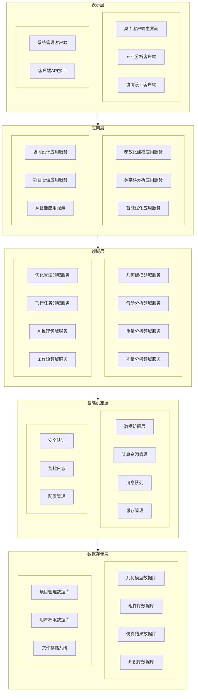
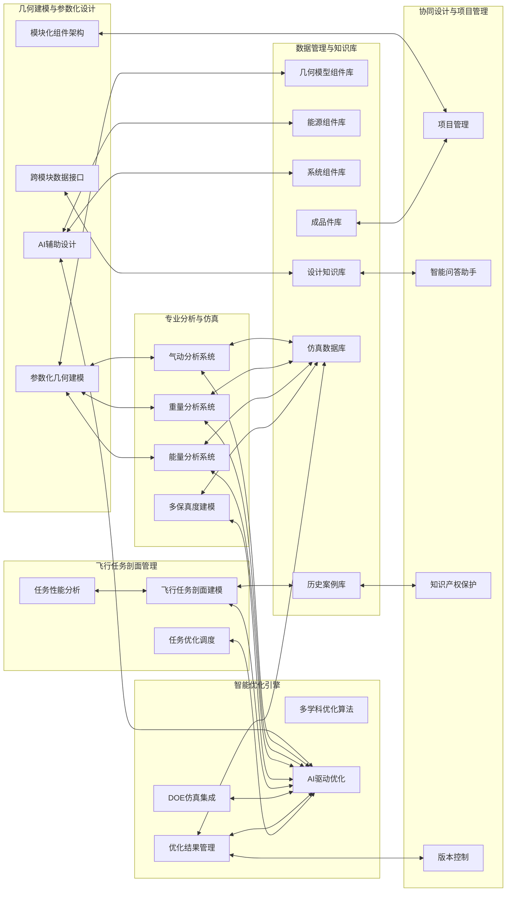
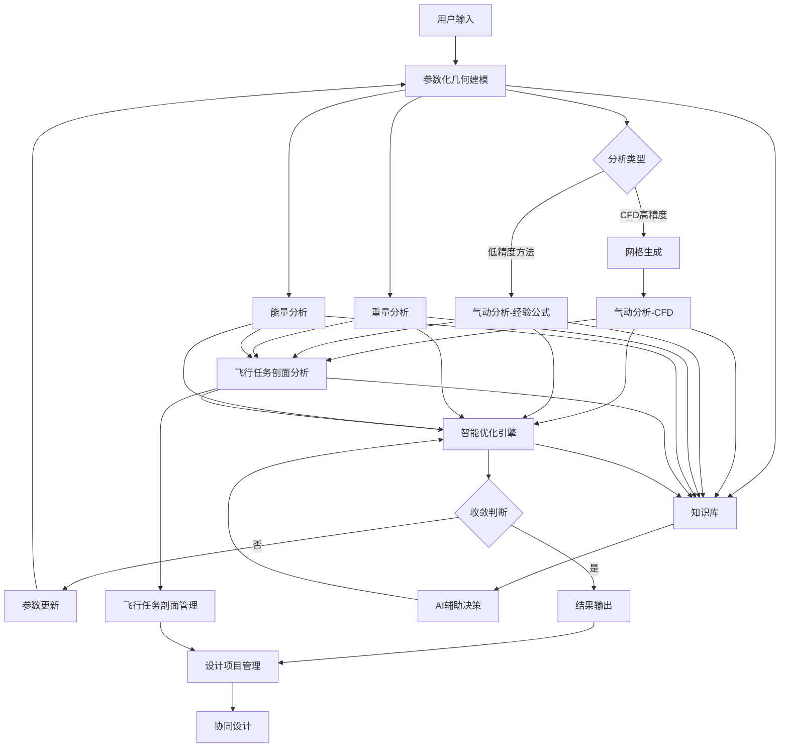

# 新一代飞行器概念设计平台ACDS规划（增强版）

## 一、项目背景

### 1. 概念设计的战略价值

飞行器概念设计是整个产品研发流程的战略制高点，其重要性源于产品开发的"倒锥型效应"——即随着项目推进，设计变更的成本呈指数级增长，而早期决策的影响范围却最为广泛。在概念设计阶段，工程师需要在有限的信息条件下做出关键的技术路线和总体参数决策，这些决策将锁定70-80%的最终产品成本和性能边界。更为关键的是，概念设计阶段是验证技术可行性、识别技术风险、评估市场前景的最佳时机，其质量直接决定了项目的成败和企业的市场竞争力。在当前飞行器技术快速演进、市场需求日益多样化的背景下，概念设计不仅要解决传统的技术问题，更要应对新兴技术集成、跨学科优化、复杂任务适应等全新挑战，这使得高效、精确的概念设计方法成为企业核心竞争力的重要组成部分。

### 2. 传统设计方法的关键痛点

传统飞行器设计方法面临的根本性挑战在于其基于经验公式和学科分割的设计范式已无法适应现代飞行器的复杂性要求。首先，飞行器系统本质上是一个高度耦合的多学科系统，气动效率直接影响燃油消耗或电能需求，进而决定燃料载重或电池重量，而动力系统重量又反过来影响结构设计和气动布局，推进系统的选择还会影响机体构型和飞行性能，传统的串行设计方法无法有效处理这种循环耦合关系，常常导致局部优化和全局次优的结果。

其次，新兴动力技术如电动推进、氢燃料电池、混合动力系统等缺乏成熟的设计准则和经验数据，而传统燃油发动机的设计方法又无法直接适用于这些新技术，设计师往往只能凭借有限的理论分析进行粗略估算，难以准确预测不同动力系统的综合性能表现。

第三，现代飞行器面临的任务剖面日趋复杂，从简单的定点悬停到复杂的垂直起降-水平巡航-精确着陆的全流程任务，从短时间作业到跨昼夜的长航时任务，传统的单点性能分析方法无法全面评估这些复杂任务场景下的综合性能表现。

最后，传统设计流程依赖物理样机验证，设计迭代周期长、成本高，在快速变化的市场环境下难以及时响应需求变化，更无法支持大规模的参数化研究和设计空间探索。同时，历史数据和设计经验难以有效转化为可复用的知识资产，导致设计过程中大量重复性工作。

### 3. 概念设计软件的解决方案

现代概念设计软件通过构建多保真度、多学科集成的数字化设计环境，从根本上解决了传统设计方法的局限性。这类软件的核心思路是建立从快速估算到高精度仿真的多层次分析体系，在概念设计的不同阶段提供相应精度的分析工具，既保证了早期设计的快速迭代能力，又在关键决策点提供了高精度的验证手段，从而在计算效率和分析精度之间实现了最优平衡。

同时，通过模块化的软件架构和统一的数据接口，这些软件实现了气动、结构、推进、控制等多学科的无缝集成和并行优化，能够自动处理学科间的耦合关系，确保设计的全局最优性。针对多样化动力技术缺乏统一设计工具的问题，现代概念设计软件内置了涵盖传统燃油发动机、电动推进、太阳能、氢燃料电池、混合动力、火箭推进等全系列动力系统的建模模块，这些模块基于最新的科学研究成果和实验数据，能够准确预测不同动力技术的性能特征，为多元化推进概念的可行性验证提供了可靠的技术支撑。

更重要的是，这些软件支持完整的任务级仿真分析，能够建立从起飞到着陆的全流程任务模型，综合考虑环境条件、飞行策略、系统状态变化等因素的影响，为复杂任务场景下的性能预测和优化提供了强有力的工具，从而使设计师能够在概念阶段就全面评估设计方案的实际应用效果。

## 二、建设目标

针对飞行器概念设计中多学科耦合分析复杂、设计周期长、专业门槛高等关键问题，发展参数化几何建模、模块化组件架构、多学科协同优化等核心技术，开展智能化多保真度分析、数据驱动降阶建模、AI辅助设计决策等关键技术研究，建立覆盖传统燃油、电动、太阳能、氢燃料电池、混合动力等多元化动力类型的新一代飞行器概念设计平台ACDS。通过参数化建模实现设计快速迭代、模块化架构支撑多学科集成、智能优化算法提升设计与决策效率，解决传统设计方法学科分割、迭代周期长、全局优化困难等核心痛点，为航空产业提供从概念设计到性能验证的全流程数字化设计工具支撑。

## 三、建设内容与方案

### 3.1 系统架构

ACDS采用经典的五层软件架构设计，确保平台的可扩展性、可维护性和高性能。整体架构自上而下分为表示层、应用层、领域层、基础设施层和数据存储层五个层次，遵循分层解耦、职责分离的设计原则。

#### 3.1.1 总体架构设计

#### 3.1.2 核心模块架构

#### 3.1.3 数据流架构

#### 3.1.4 技术架构特点

**🏗️ 分层架构设计**
* **表示层**：专业桌面客户端架构，提供高性能的本地计算能力和丰富的交互体验
* **应用层**：业务应用服务编排，实现用例驱动的业务流程管理
* **领域层**：核心业务逻辑封装，专业领域服务独立部署和扩展
* **基础设施层**：技术能力支撑，包括数据访问、计算资源、消息通信等
* **数据存储层**：多类型数据库支持，分布式存储和高可用保障

**⚙️ 技术架构优势**
* **微服务架构**：各领域服务独立开发、部署和扩展，提高系统弹性和可维护性
* **容器化部署**：基于Docker容器技术，支持云原生部署和自动化运维
* **API优先设计**：标准化接口设计，支持第三方集成和生态建设
* **分布式计算**：计算任务智能调度，充分利用集群资源提升计算效率
* **数据安全**：多层次安全防护，从网络到应用到数据的全方位安全保障
* **智能化集成**：AI能力深度融合各业务层，实现智能化的端到端设计流程
* **通用优化架构**：优化引擎支持多种优化类型，可扩展的算法框架设计

### 3.2 几何建模与参数化设计

#### 3.2.1 参数化几何建模

##### 外形建模

* **总体构型支持**：预置滑翔机、多机身、翼身融合、飞翼、隐身等五种典型构型，支持快速创建对应飞行器布局。用户可基于基础实例进行参数修改，快速生成新的部件外形和内部结构。
* **多元化部件建模**：

  - **机身部件**：按截面+引导线方式定义，支持圆锥曲线截面（圆形、椭圆、抛物线、双曲线）
  - **机翼部件**：按翼型+引导线方式定义，支持.dat文件导入和CST公式定义翼型
  - **螺旋桨部件**：完整的螺旋桨几何和运动学特性建模
  - **进气道设计**：按进口形状、出口形状及中心引导线方式定义，支持进气道堵锥外形生成和激波控制结构设计
* **部件操作功能**：

  - **复制功能**：全局支持所有部件对象的复制，自动分配唯一标识符
  - **对称功能**：支持绕X-Y、Y-Z或X-Z平面进行对称操作
  - **移动和缩放**：支持空间坐标系中的精确位置调整和比例缩放
  - **多部件支持**：机身、机翼数量不限，支持复杂航空模型架构
* **先进建模技术**：支持CST参数化方法、B样条曲面建模、特征驱动建模等多种建模技术。集成机翼、机身、尾翼、发动机短舱等标准组件库，支持eVTOL、超音速飞机等新概念构型的快速建模。提供智能约束求解器，自动处理几何约束和设计规则。
* **布尔操作功能**：处理外形相交部分，支持联合、组合、拆分、相交和剪除等操作，满足复杂几何形状处理需求。

##### 舱位划分与管理

* **可视化模型切分**：通过在三视图上绘制直线，生成对应平面，将飞机切分为若干子块，支持分析、拆解、装配等需求。
* **舱位划分方法**：通过组件库+舱实例模型组织，支持从粗略布局到高保真三维模型的全过程，特别适合座椅布局、行李舱、卫生间、舱壁等细节设计。
* **舱位实体化**：支持将舱位定义为油箱属性并自动实体化，实现精确的体积和容积计算。

##### 总体布置系统

* **预制几何体库**：提供圆柱、六面体等预制几何体作为成品定义基础，支持圆形、方形、超椭圆等多种截面类型。
* **成品属性管理**：

  - **参数属性**：尺寸、颜色、材质等可定制化配置
  - **重量重心属性**：完整的重量和重心位置设置
  - **接口定义**：电气接口、液冷接口、风冷接口、区域安全性等扩展接口
  - **成品布置**：通过全局坐标精确定位在预划分舱位中
* **起落架系统**：

  - **参数定义**：前主轮距、主轮站位、静态地面线、轮胎状态设置
  - **动态计算**：防侧翻角、擦地角、防倒立角的自动计算
  - **收起功能**：起落架收起角度定义和运动轨迹验证
* **数据管理**：成品可保存在数据库中供后续直接选择，支持设计复用和知识积累。
* **智能几何优化**：基于历史设计数据的几何模式识别，能够自动检测和修正几何异常，提供设计规则检查和优化建议。

#### 3.2.2 模块化组件架构

##### 几何组件体系

* **组件库架构**：基于升力体基类的三维几何建模架构，包括机翼系统（主翼、水平尾翼、垂直尾翼）、机身、短舱等核心组件，支持复杂气动外形定义和参数化驱动。集成组件性能预测模型。

##### 能源组件体系

* **完整能量流建模**：构建完整的能量流建模框架
  - **能量存储**：电池组、燃油箱等储能设备建模，集成衰减和热管理模型
  - **能量转换**：电机、内燃机、燃料电池、太阳能板、燃气轮机等转换设备的高精度建模
  - **推进装置**：螺旋桨、旋翼、喷嘴等推进器建模，支持性能优化

##### 系统组件体系

* **机载系统建模**：航电设备、载荷系统等机载子系统的功耗特性和重量特性建模，支持系统级能量管理和性能分析。
* **架构特性**：基于物理组件基类的继承体系，集成质量特性和重心位置的自动管理，支持递归质量计算和配置差异化管理。

#### 3.2.3 AI辅助设计

* **智能设计生成**：基于深度学习的外形生成算法，支持从性能需求到几何外形的智能转换。集成设计知识图谱，提供基于案例推理的设计建议。支持自然语言交互，允许设计师通过描述性语言快速创建初始构型。
* **设计空间智能探索**：基于强化学习的设计空间搜索策略，能够自动发现高性能设计区域，并提供设计改进建议。

#### 3.2.4 跨模块数据接口

* **智能数据流管理**：

  - **自动数据传递**：AI自动检测模块间数据依赖关系，智能调度数据传递流程
  - **格式智能转换**：自动处理不同模块间的数据格式转换和单位统一
  - **完整性验证**：AI实时检查数据完整性和一致性，预防下游模块计算错误
* **智能流程协调**：

  - **任务智能排序**：AI分析任务依赖关系，自动优化执行顺序，提高整体效率
  - **资源动态分配**：智能监控计算资源使用情况，动态调整各模块的资源分配
  - **异常智能处理**：自动检测和处理模块间的异常情况，提供智能化的错误修复建议
* **设计流程智能引导**：

  - **最佳实践推荐**：基于历史设计数据和专家经验，AI推荐最优的设计流程路径
  - **关键节点提醒**：智能识别设计过程中的关键决策点，及时提醒用户注意事项
  - **质量智能监控**：全程监控设计质量，智能预警潜在的设计风险和问题

### 3.3 多保真度分析与仿真

#### 3.3.1 分层计算体系

* **零保真度层（Fidelity 0）**：基于经验公式和统计模型的秒级快速评估，集成智能化的经验公式选择和参数校准机制。
* **低保真度层（Fidelity 1）**：采用势流理论、涡格法(VLM)的分钟级工程分析，整合降阶模型技术实现计算加速。
* **高保真度层（Fidelity 2）**：基于Euler方程CFD求解器和基于N-S方程的CFD求解器的小时级精确计算，集成自适应网格和并行计算技术。
* **验证校准层**：结合试验数据的模型校准和验证，支持多保真度数据的智能融合和不确定性量化。

#### 3.3.2 数据驱动的降阶建模技术

* **多源数据融合建模**：支持历史试验数据、仿真数据和专家知识的融合，构建高精度降阶模型（ROM）。通过Co-Kriging算法和多保真度神经网络，实现用较少试验成本获得较高精度的目标。
* **自适应模型选择**：基于数据特征自动推荐最适合的建模算法，支持从传统机器学习到深度学习的全谱系算法。采用并行训练框架，能同时训练多个算法模型并实时对比性能。
* **在线学习与模型更新**：支持基于新数据的模型在线更新，通过贝叶斯更新机制实现模型的持续改进。

#### 3.3.3 专业分析能力

##### CFD计算系统

* **智能网格生成**：

  - **外形自动修补**：自动检测并修复几何不连续性、表面缺陷、外形完整性等问题，支持多种缺陷类型的智能识别和修复
  - **远场边界生成**：支持长方体、圆柱形、球形等多种边界形状的参数化定义和自动生成
  - **计算网格自动生成**：支持三维四面体、六面体网格类型，提供全局/局部尺寸控制和边界层网格生成
  - **网格质量优化**：集成网格质量评估、平滑优化和特征调整算法，确保高质量计算网格
* **CFD前处理系统**：

  - **边界条件设置**：支持无滑移壁面、压力远场等多种边界条件的设置
  - **流场工质配置**：内置标准CFD工质库，支持理想气体、空气等工质的物性设置
  - **数值格式控制**：提供CFL自适应、多重网格、高阶格式等数值计算配置
  - **参考值设置**：支持参考坐标、参考长度、参考面积等全局参考值配置
* **CFD求解与后处理**：

  - **求解器管理**：支持稳态/瞬态、可压缩/不可压缩、多种湍流模型的求解器配置
  - **收敛监控**：通过升力/阻力系数监控收敛情况，自动生成计算报告
  - **结果可视化**：支持压力、速度、马赫数等多种云图绘制，提供矢量图和截面分析功能
  - **批量计算**：支持多工况（迎角、速度、高度）的批量CFD计算和结果管理
  - **气动数据库**：自动生成升力、阻力、力矩数据库，为性能分析提供精确数据支撑

##### 智能化流场降阶技术

* **ROM构建与应用**：

  - **训练阶段**：通过DOE智能采样和批量CFD计算生成流场"快照"数据，采用POD方法提取主要模态
  - **AI代理模型**：训练轻量化神经网络学习模态系数与设计变量的映射关系
  - **实时预测**：基于新工况参数以毫秒级速度预测气动性能和完整流场分布
  - **数据融合**：智能融合不同保真度的仿真数据，提升预测精度
* **近实时分析能力**：

  - **快速响应**：将传统小时级CFD计算缩短至毫秒级预测
  - **全流场重建**：能够重建完整的压力、速度、温度等流场信息
  - **设计空间探索**：快速生成完备的气动数据库，支持大规模参数研究
  - **优化集成**：为优化提供高频次的气动性能评估支持
* **自适应求解技术**：集成智能网格生成和自适应求解技术，实现计算精度与效率的最优平衡。
* **AI辅助前处理系统**：

  - **智能设置向导**：开发对话式、向导式交互界面，引导用户完成复杂的CFD前处理设置
  - **自然语言解析**：将用户的工程描述（如"高马赫数可压缩流动"）自动解析为具体的求解器参数
  - **自动配置生成**：根据用户回答智能填充边界条件、流体工质、湍流模型等配置参数
  - **专家知识固化**：将CFD专家经验封装为智能决策规则，降低技术门槛

##### 多学科分析模块

* **气动分析模块**：支持从零保真度经验公式到涡格法、CFD求解器的多层级分析，特别强化了旋翼干扰、地面效应、非定常气动现象等复杂气动问题的建模能力。
* **推进系统建模**：集成燃气轮机、活塞发动机、电动、太阳能、氢燃料电池等多种动力系统的统一建模框架。每个动力模块都基于最新的科学研究成果和实验数据构建。
* **重量与重心计算体系**：

  - **重心坐标管理**：支持飞机前、后重心全局坐标设置，实现精确的重心位置控制
  - **全机重心校核**：根据总体布置结果自动计算校核当前全机重心位置，确保飞行安全与性能优化
  - **油箱系统管理**：
    * **油量定义**：根据油箱几何体精确指定各油箱油量
    * **油心校核**：校核全机油箱定义油量下的油心位置
    * **耗油策略**：定义各油箱耗油顺序，支持多油箱按比例同时耗油，支持武器发射时对应耗油量定义
  - **重心变化分析**：
    * **油箱切片功能**：通过几何体切片技术，实现指定油量下的精确体积计算
    * **动态重心曲线**：计算油量消耗过程中全机重心变化曲线，确保飞行过程中的重心稳定性
* **重量估算体系**：针对固定翼机、旋翼机等多种飞行器的专用重量模型，支持实时质量变化计算。集成基于机器学习的重量预测模型，显著提升预测精度。

### 3.4 数据管理与知识库

#### 3.4.1 历史数据智能化处理

* **多格式数据支持**：支持CSV、Excel、HDF5、NetCDF、MAT等多种数据格式的智能识别和导入，可处理大规模工程数据。
* **智能数据质量评估**：内置数据质量评估算法，自动检测缺失值、异常值、重复值等数据质量问题，提供智能化的数据清洗建议。
* **自动特征工程**：基于领域知识的自动特征生成，包括多项式特征、交互特征、时间特征和聚合特征，显著提升建模效果。

#### 3.3.2 设计知识智能化管理

* **设计经验知识化**：将分散的设计经验转化为结构化的知识图谱，支持基于案例的设计推理和知识重用。
* **智能设计规则提取**：从历史设计数据中自动提取设计规则和约束关系，为新设计提供智能化的设计指导。

#### 3.3.3 参数化数据实例库系统

##### 中心数据库架构

* **多学科数据统一管理**：构建面向多学科集成设计的中心数据库，统一存储气动、结构、动力等学科的设计参数、仿真结果及迭代数据。
* **核心功能模块**：

  - **数据存储模块**：结构化存储学科参数（气动压力分布、结构材料属性）与非结构化数据（CAE报告）
  - **数据集成模块**：整合多数据源，形成统一数据视图，解决"数据孤岛"问题
  - **数据访问模块**：提供标准API接口供各学科工具调用，支持实时和批量数据交换
  - **数据管理模块**：实现数据版本控制、权限分配、审计追踪等管理功能
* **技术架构特点**：

  - **数据模型**：采用面向对象设计，遵循CPACS等航空数据标准实现规范统一
  - **安全机制**：分级权限控制、加密传输和异地灾备策略，保障数据安全
  - **性能优化**：实时交互毫秒级响应，大规模仿真数据定时批量传输

##### 客户端数据库功能

* **本地实例管理**：

  - **数据创建与导入**：支持多种数据记录类型，自动识别和导入指定格式数据
  - **关键参数录入**：提供直观界面用于机器数据关键几何参数的输入和编辑
  - **一键保存与调用**：设计和性能分析过程中实现计算成果的"一键保存"与调用
  - **多级目录管理**：按多级目录形式管理数据，支持删除、重命名、复制等操作
* **高级数据功能**：

  - **性能图数据管理**：提供界面显示性能图数据，支持剪切、缩放、对比、类型转换等操作
  - **智能搜索系统**：
    * **多条件搜索**：根据关键几何参数、性能参数、创建人、时间等进行搜索
    * **复杂逻辑搜索**：支持多条件下的"或、且、非"逻辑搜索功能
    * **可视化管理**：设计知识的可视化管理和快速检索

##### 飞行器部件实例库

* **机身外形数据库**：

  - **分类管理**：按亚音速、超音速、高超音速等分类建立机身外形实例
  - **参数化区域**：可用参数描述并在后续使用中修改的关键几何部分
  - **特征保留**：保留机鼻、整流罩等特征曲面，表达机型几何特征
* **机翼结构数据库**：

  - **结构参数**：包含结构布置参数和结构件尺寸参数
  - **构型支持**：支持各种机翼类型的内部结构实例建模
  - **组合设计**：支持不同部件组合形成多样化整机布局方案
* **通用组件库**：

  - **标准组件**：机翼、机身、尾翼、发动机短舱等标准组件库
  - **专用组件**：eVTOL、超音速飞机等新概念构型的专用组件
  - **成品管理**：预制几何体、成品属性、接口定义等完整成品管理体系

##### 协同设计与数据安全

* **权限管理系统**：

  - **用户管理**：支持用户创建、删除、权限分配等完整用户管理功能
  - **数据权限**：实现不同类别数据、不同密级数据的安全管理
  - **操作审计**：完整记录用户操作日志，支持登录信息查看和管理
* **多单位协同机制**：

  - **ROM交付模式**：通过标准化降阶模型接口实现知识产权保护的协同设计
  - **数据标准化**：建立统一数据格式标准，支持与主流软件的安全数据交换
  - **版本控制**：提供完整的版本管理和变更追踪功能
* **数据备份与恢复**：

  - **可视化备份**：支持可视化方式进行数据库备份和恢复
  - **容灾机制**：提供异地备份和灾难恢复能力
  - **数据导出**：支持指定文件格式的数据导出，有效衔接现有设计工具

### 3.5 多学科优化与飞行任务剖面管理

#### 3.5.1 多段飞行任务建模

* **复杂飞行剖面**：支持起飞、爬升、巡航、下降、着陆等多段飞行任务的精确建模。
* **实时状态更新**：在任务执行过程中实时计算燃料消耗、电能消耗和质量变化，支持动态性能预测。
* **任务自适应优化**：基于实时性能评估的任务剖面动态优化。

##### 飞行性能计算系统

* **外接求解器支持**：提供灵活的外接求解器调用机制，支持多种软件形态与调用方式

  - **编译库集成**：支持lib/dll直接编译进软件，提供基础API接口
  - **可执行文件调用**：通过命令行接口调用外部exe求解器，约定输入输出文件格式
  - **多语言支持**：兼容C++、Python等多种语言开发的性能分析模块
* **性能校核与评估**：

  - **批量数据导入**：支持CSV、JSON、XML等多种格式的CFD气动数据批量导入
  - **接口机制**：通过统一API实现与CFD数据库的无缝连接
  - **多学科数据集成**：整合气动数据库（CL/CD/Cm）、重量数据、推力特性等关键参数
  - **数据校验**：自动检查数据完整性、单位一致性与格式正确性
* **关键性能指标计算**：

  - **起降性能**：精确计算起飞滑跑距离、着陆距离等关键指标
  - **航程航时分析**：基于燃料消耗和能量管理的航程/航时计算
  - **爬升性能**：最大爬升率、服务升限等爬升性能评估
  - **机动性能**：稳盘过载、转弯半径等机动特性分析
* **性能结果处理**：

  - **结果可视化**：以图表和曲线形式展示性能计算结果趋势
  - **数据归档**：将性能评估结果与设计版本绑定管理
  - **反馈机制**：性能不足时自动推送至外形设计或优化模块

#### 3.5.2 多学科优化引擎

##### 优化问题定义与流程

* **多学科优化流程**：构建从外形建模→重心校核→CFD计算→性能校核→优化的完整闭环流程，实现全链条自动化设计优化。
* **优化目标设置**：

  - **性能数据读取**：自动从性能计算模块读取关键性能指标（起降距离、航程航时、稳盘过载、爬升率等）
  - **多目标优化**：支持同时设置多个优化目标（最小阻力、最大升力、最小燃油消耗等），可设置目标权重
  - **约束条件管理**：支持几何约束、性能约束、工程约束等多类型约束的统一管理
* **参数化优化设置**：

  - **外形参数调整**：支持机翼展弦比、前后掠角、机身长度、进气道位置等关键外形参数的自动调整
  - **参数范围控制**：用户可设置每个设计变量的取值范围、初始值与步长，实现精细化控制
  - **参数化建模接口**：与外形建模模块深度集成，支持参数修改后的模型自动重建

##### 先进AI驱动优化算法体系

* **新一代智能优化算法**：

  - **小样本机器学习**：基于有限样本数据快速构建高精度代理模型，显著减少仿真计算次数
  - **AI驱动采样**：通过机器学习技术智能分析已有结果，发掘变量敏感度、相关性和有效取值区间
  - **知识引导搜索**：利用AI技术对设计空间进行智能分析，引导优化搜索方向
  - **自适应采样策略**：动态调整采样策略，采样-学习-再采样的智能循环，持续提高学习精度
* **AI增强的优化特性**：

  - **变量空间智能缩减**：通过AI分析自动识别和排除低敏感度变量，聚焦关键设计参数
  - **约束智能处理**：AI自动学习约束边界，提前预测不可行区域，提高搜索效率
  - **多保真度融合**：智能融合不同精度的分析结果，在精度和效率间实现最优平衡
  - **经验知识整合**：将专家经验和历史设计数据转化为AI可理解的约束和指导规则
* **专业优化能力增强**：

  - **复杂问题求解**：特别擅长高变量（>10）、强约束、昂贵约束、黑箱优化等复杂工程问题
  - **多学科智能协同**：AI自动协调多学科间的耦合关系，实现真正的多学科一体化优化
  - **实时优化调度**：基于计算资源和时间约束，AI智能调度优化任务，最大化计算效率
  - **不确定性智能量化**：AI驱动的鲁棒性分析和可靠性优化，自动识别设计风险
* **多算法集成优化**：

  - **智能算法组合**：AI自动分析问题特征，推荐和组合最适合的优化算法
  - **算法性能预测**：基于历史数据预测不同算法在当前问题上的性能表现
  - **并行智能执行**：多算法并行执行，AI实时分析各算法收敛情况，动态调整资源分配

##### 优化结果管理与反馈

* **实时监控与可视化**：

  - **优化过程监控**：实时绘制性能指标响应曲线，展示每轮迭代的性能变化
  - **设计点管理**：完整记录优化过程中每个设计点的参数与性能指标
  - **结果可视化**：提供雷达图、折线图等多种形式的结果展示
* **智能结果评估**：

  - **自动收敛判断**：当设计方案满足预设要求时，自动停止优化并输出结果
  - **多方案对比**：支持不同设计方案的性能对比和技术路线选择
  - **设计历史追溯**：支持设计过程的完整记录和方案回溯
* **优化结果输出**：

  - **设计方案导出**：将满足要求的设计方案以清晰形式展示，包括外形参数、性能指标等
  - **多格式支持**：提供PDF、Excel、CAD模型等多种格式的结果导出
  - **知识积累**：将优化经验转化为设计知识库，为后续项目提供参考
* **设计空间智能管理**：支持高维参数空间的可视化展示和交互式探索，提供智能化的设计空间缩减策略。

#### 3.5.3 DOE仿真集成与智能调度

* **智能实验设计**：支持全因子设计、响应面方法、拉丁超立方采样等多种DOE方法，基于模型不确定性智能选择实验点。
* **CAE软件深度集成**：与STAR-CCM+、ANSYS、Amesim等主流CAE软件深度集成，支持自动参数提取和批量仿真。
* **智能任务调度**：采用智能任务调度算法，自动优化计算资源分配，提供失败检测和自动重试机制。

### 3.6 协同设计与项目管理

#### 3.6.1 智能项目管理系统

* **多团队协同**：支持多团队、多学科的协同设计工作流，提供版本控制、权限管理、任务分配、进度跟踪等项目管理功能。
* **智能进度预测**：基于历史项目数据的进度预测和风险评估。

#### 3.6.2 智能问答助手系统

* **知识库构建**：

  - **技术文档集成**：将设计手册、操作指南、行业标准等文档向量化存储
  - **RAG技术架构**：基于检索增强生成技术，实现精准的知识检索和回答生成
  - **实时更新机制**：支持知识库的动态更新和扩展
* **智能交互功能**：

  - **自然语言查询**：支持用户用自然语言提问软件功能、操作步骤及设计理论
  - **上下文理解**：具备多轮对话能力，理解用户问题的上下文关联
  - **多模态支持**：支持文本、图片、图表等多种形式的问答交互
* **专业知识服务**：

  - **设计理论指导**：提供飞行器设计理论、工程经验、最佳实践的即时咨询
  - **操作指导**：实时解答软件功能使用、参数设置、故障排除等问题
  - **技术支持减负**：显著减少用户对外部技术支持的依赖，提升自主解决问题能力

#### 3.6.3 知识产权保护的协同机制

* **ROM交付模式**：通过标准化降阶模型接口实现多单位协同设计，既保护各方知识产权又实现高效协作。
* **数据安全共享**：建立统一的数据格式标准，支持与CATIA、NX、ANSYS、Fluent等主流软件的安全数据交换。

## 四、ACDS先进性

### 1. 数据驱动的智能化设计

ACDS通过集成先进的机器学习和人工智能技术，实现了从经验驱动向数据驱动的设计模式转变。平台能够智能化处理历史设计数据、试验数据和仿真数据，自动提取设计知识和规律，构建高精度的降阶模型。这种数据驱动的方法不仅显著提升了设计效率，更重要的是能够将企业的设计经验转化为可复用的知识资产，避免重复性工作，确保设计质量的一致性。

### 2. 多保真度融合建模技术

ACDS在建模方法上实现了重要突破，通过Co-Kriging算法和多保真度神经网络技术，能够智能融合不同精度的数据源，从低保真度仿真到高保真度试验数据。这种融合技术能够在有限试验数据的基础上，充分利用低成本仿真数据，构建高精度的预测模型，实现成本和精度的最优平衡。平台还支持基于不确定性的智能试验设计，能够自动选择最有价值的试验验证点。

### 3. 开放式架构设计

ACDS采用模块化的开放式软件架构，为客户提供了强大的定制化开发能力。客户可以在现有平台基础上无缝集成自有的核心技术成果，包括专用分析算法、试验数据库、设计准则库或特殊组件模型，快速构建符合企业特定需求的专业化设计环境。这种架构设计既保护了客户的技术投资，又充分利用了ACDS的成熟平台能力。

### 4. 前瞻性技术集成

ACDS在技术集成方面采用了前瞻性的设计理念，构建了涵盖传统到新兴技术的完整技术谱系。系统内置了从传统燃油发动机、燃气轮机到电动推进、太阳能、氢燃料电池、混合动力乃至火箭推进等全系列动力技术的精确建模模块，每个模块都基于最新的科学研究成果和工程实践数据开发，确保了对不同技术路线性能特征的准确预测。

### 5. 全面的AI驱动智能化技术

ACDS在多个层面实现了深度智能化，构建了完整的AI驱动设计生态：

* **智能化前处理系统**：通过自然语言处理和专家知识固化，将复杂的CFD设置转化为简单的对话交互，显著降低技术门槛
* **AI辅助设计决策**：基于深度学习和知识图谱技术，提供智能设计建议和最佳实践推荐
* **智能化流程协调**：AI自动管理模块间数据流，智能调度计算任务，实现全流程的自动化协调
* **新一代优化算法**：集成基于小样本机器学习的智能优化技术，通过AI驱动采样和知识引导搜索，显著提升优化效率
* **降阶建模技术**：结合POD和神经网络技术，实现从小时级CFD计算到毫秒级预测的跨越式提升
* **智能问答助手**：基于RAG技术构建的知识服务系统，将静态文档转化为动态交互式帮助

### 6. 自动化机器学习集成

ACDS集成了先进的自动机器学习（AutoML）技术，支持智能特征工程、算法选择和超参数优化。系统能够基于数据特征自动推荐最适合的分析方法和优化策略，显著降低了建模门槛，使非AI背景的工程师也能构建高质量的分析模型。

## 五、应用场景与价值

### 1. 电动垂直起降飞行器（eVTOL）设计

**客户痛点**：eVTOL设计涉及复杂的垂直起降和巡航模式转换，需要精确的电动推进系统建模和多模态性能优化。

**ACDS价值**：

* 提供专门的eVTOL分析模块，支持升力+巡航配置的精确建模
* 集成智能化的电池放电模型和电机效率模型，准确预测电动推进系统续航性能
* 支持悬停、过渡、巡航等多段飞行任务的完整分析
* 通过数据驱动的降阶建模技术，快速优化旋翼/推进器配置和能量管理策略

### 2. 太阳能长航时飞行器设计

**客户痛点**：太阳能飞行器设计需要精确的太阳能辐射建模和能量平衡分析，以及跨昼夜的复杂任务规划。

**ACDS价值**：

* 集成智能化的太阳能辐射模型，支持不同地理位置和时间的太阳能可用性分析
* 提供完整的能量平衡计算，包括太阳能收集、电池存储、推进消耗的动态建模
* 支持昼夜循环的长时间任务仿真，准确预测续航能力
* 通过机器学习优化太阳能电池板布局和能量管理策略

### 3. 多旋翼飞行器概念设计

**客户痛点**：多旋翼飞行器设计需要精确的旋翼空气动力学和动力系统性能建模，以及多目标性能优化。

**ACDS价值**：

* 提供智能化的螺旋桨设计和性能分析工具，支持多旋翼配置的精确建模
* 支持电池驱动、燃油驱动和混合动力等多种动力方案的统一建模分析
* 基于历史数据的旋翼干扰效应建模，提升预测精度
* 通过智能优化算法快速对比分析不同旋翼数量和配置方案

### 4. 多元化动力飞行器设计

**客户痛点**：现代飞行器采用多样化动力方案，从传统燃油到新兴清洁能源，缺乏统一的分析平台。

**ACDS价值**：

* 支持燃气轮机、活塞发动机、电动、太阳能、氢燃料电池、混合动力等全谱系动力建模
* 提供多能源协同工作的仿真验证，智能优化不同动力方案的能源分配策略
* 支持传统动力与新兴动力方案的性能对比和技术路线选择
* 通过数据融合技术整合不同动力技术的试验和仿真数据

### 5. 多单位协同设计项目

**客户痛点**：复杂飞行器项目涉及多个设计单位，传统方法难以在保护知识产权的同时实现高效协作。

**ACDS价值**：

* 通过标准化降阶模型接口实现知识产权保护的协同设计
* 各单位可基于自有数据构建专用ROM，在不暴露核心数据的前提下实现系统级集成
* 支持多层次的设计验证和优化，显著提升协同效率
* 提供统一的项目管理和版本控制平台

### 6. 固定翼商用客机设计

**客户痛点**：传统商用客机设计周期长、成本高，需要精确的载荷-航程分析、多段飞行任务优化和复杂的推进系统建模。

**ACDS价值**：

* **载荷-航程图生成**：自动生成详细的载荷-航程图，支持航空公司运营决策和飞机性能验证
* **多段飞行任务建模**：精确建模完整商业飞行剖面（起飞-爬升-巡航-下降-着陆），优化燃油效率
* **涡轮风扇发动机集成**：深度集成现代涡轮风扇发动机模型，支持不同涵道比和推力等级的精确分析
* **区域客机优化**：针对支线和区域客机（如E-190类型）提供专门的设计优化功能

**典型应用案例**：

- **波音737类型单通道客机**：支持150-200座级客机的概念设计，包括超音速升级版本
- **Embraer E-190区域客机**：70-120座级区域客机的载荷-航程优化和性能分析
- **协和式超音速客机**：马赫2.0+超音速客机的先进气动设计和推进系统集成

### 7. 超音速固定翼飞机设计

**客户痛点**：超音速飞机设计面临激波阻力、热管理、结构载荷等复杂挑战，传统设计工具难以处理超音速特有的气动现象。

**ACDS价值**：

* **超音速气动分析**：集成专用的超音速气动分析模块，精确处理激波、边界层相互作用等复杂现象
* **热防护系统设计**：支持高温环境下的材料选择和热防护系统设计
* **涡轮喷气发动机建模**：高保真度的超音速推进系统建模，包括加力燃烧室和可变几何进气道
* **多保真度分析**：从快速估算到CFD精确计算的多层次分析体系，平衡精度与效率

**设计特色**：

- **马赫2.0+巡航能力**：支持高超音速巡航性能分析和优化
- **三角翼/后掠翼配置**：专门适配超音速飞机的特殊气动布局
- **推进-机体一体化**：优化超音速条件下的推进系统与机体集成设计

### 8. 高效亚音速运输机设计

**客户痛点**：现代亚音速运输机追求更高的燃油效率、更低的噪音和更大的载客量，需要精细的气动优化和系统集成。

**ACDS价值**：

* **高展弦比机翼设计**：支持现代高效机翼的参数化设计和优化，包括翼梢小翼等先进技术
* **发动机-机翼集成优化**：精确建模发动机安装对机翼气动特性的影响，优化推进效率
* **多点设计优化**：同时优化起飞、爬升、巡航等多个设计点，确保全包络线性能
* **噪音和排放分析**：集成环境影响评估功能，支持绿色航空技术发展

**关键技术**：

- **自然层流技术**：支持层流机翼设计和边界层转捩控制分析
- **先进材料应用**：集成复合材料特性，优化结构重量和性能
- **智能飞行控制**：支持现代电传飞控系统的设计和分析

### 9. 参数化快速设计与智能优化

**客户痛点**：传统飞行器设计依赖经验公式和手工建模，设计迭代周期长、效率低，难以满足快速响应市场需求。

**ACDS价值**：

* **参数化建模驱动**：通过参数化几何建模实现设计方案的快速生成和修改，支持智能优化迭代
* **全流程自动化**：从外形建模→重心校核→CFD计算→性能评估→智能优化的完整自动化流程
* **多学科协同优化**：集成气动、结构、推进、控制等多学科的无缝协同，确保设计全局最优
* **AI驱动的智能采样**：基于小样本机器学习的优化算法，以更少迭代次数找到全局最优解
* **设计知识复用**：建立参数化实例库，将历史设计经验转化为可复用的知识资产

### 10. AI增强的智能化设计流程

**客户痛点**：传统设计流程高度依赖专家经验，技术门槛高，新手培训周期长，设计质量不稳定。

**ACDS价值**：

* **AI辅助决策**：通过智能设置向导和问答助手，将专家知识固化为AI服务，显著降低使用门槛
* **流程智能化**：AI自动协调多模块协同，智能调度计算资源，实现设计流程的高度自动化
* **实时质量监控**：AI全程监控设计质量，智能识别潜在风险，提前预警设计问题
* **知识智能传承**：通过AI技术将资深专家的设计经验转化为可复用的智能化工具
* **效率跨越提升**：ROM技术使CFD计算从小时级降至毫秒级，智能优化算法减少90%以上的迭代次数

### 11. 数字孪生与智能运维

**客户痛点**：飞行器运营需要实时性能监控和预测维护，传统方法计算复杂度高、响应慢。

**ACDS价值**：

* 基于历史运营数据构建高精度降阶模型，支持实时性能预测
* 提供智能健康管理功能，预测关键部件的性能衰退和维护需求
* 支持任务自适应规划，根据实时状态动态优化飞行策略
* 通过虚拟传感器技术扩展监测能力边界

## 六、技术路线图与实施计划

### 第一阶段：核心平台构建（0-18个月）

#### 6个月（原型验证期）
* **几何建模系统**：完成参数化几何建模核心算法，支持机翼、机身基础构型
* **分析框架搭建**：建立CFD网格生成、气动分析低精度方法（经验公式）
* **数据架构**：设计并实现核心数据库结构，包括几何模型库和组件库
* **系统架构**：完成五层软件架构的基础框架搭建

#### 12个月（核心功能期）
* **完整建模能力**：实现完整的参数化几何建模，支持5种典型飞行器构型
* **多学科分析**：完成气动、重量、能量三大分析模块的基础功能
* **优化引擎V1.0**：实现基础的多学科优化算法，支持梯度优化和遗传算法
* **用户界面**：完成桌面客户端主界面和专业分析客户端开发

#### 18个月（集成测试期）
* **系统集成**：完成所有核心模块的集成，实现端到端的设计流程
* **性能优化**：优化计算性能，CFD计算效率提升5倍以上
* **初步验证**：完成2-3个典型飞行器案例的验证测试

### 第二阶段：智能化增强（18-30个月）

#### 24个月（AI集成期）
* **AI辅助建模**：实现基于机器学习的几何形状生成和优化建议
* **智能前处理**：开发AI辅助的CFD前处理系统，自动网格生成和边界条件设置
* **降阶建模**：完成智能化流场降阶技术，实现神经网络代理模型
* **智能问答系统**：基于RAG技术的设计知识问答助手

#### 30个月（智能优化期）
* **高级优化算法**：集成AI驱动的优化算法，包括贝叶斯优化、强化学习等
* **多保真度融合**：实现不同精度分析方法的智能融合和切换
* **智能设计空间探索**：自动识别设计空间的有效区域和关键参数
* **协同智能**：实现多用户协同设计中的智能冲突检测和解决建议

### 第三阶段：工程化完善（30-36个月）

#### 36个月（工程化完成期）
* **工程数据库**：建立完整的航空工程组件库、成品件库和标准件库
* **工程约束集成**：集成真实的工程约束条件，包括制造、维护、认证要求
* **高精度分析**：集成商业CFD求解器接口，实现高精度仿真计算
* **项目管理增强**：完善项目管理功能，支持复杂工程项目的全生命周期管理
* **系统验证**：完成3-5个典型飞行器案例的完整验证，确保系统稳定性和可靠性
* **性能达标**：确保所有技术指标达到设计要求，具备工程应用能力

### 实施计划甘特图

```mermaid
gantt
    title ACDS平台开发时间线
    dateFormat  X
    axisFormat %s个月
    
    section 第一阶段
    原型验证期        :active, phase1a, 0, 6
    核心功能期        :phase1b, 6, 12
    集成测试期        :phase1c, 12, 18
    
    section 第二阶段  
    AI集成期         :phase2a, 18, 24
    智能优化期        :phase2b, 24, 30
    
    section 第三阶段
    工程化完成期      :phase3a, 30, 36
    
    section 关键里程碑
    核心平台原型      :milestone, m1, 6, 0
    基础功能完成      :milestone, m2, 18, 0  
    AI功能集成       :milestone, m3, 30, 0
    工程化完成       :milestone, m4, 36, 0
```

### 关键里程碑与交付物

#### 🎯 第一阶段里程碑
- **M1 (6个月)**：核心平台原型，基础建模和分析能力
- **M2 (18个月)**：完整功能平台V1.0，支持端到端设计流程

#### 🎯 第二阶段里程碑  
- **M3 (30个月)**：智能化平台V2.0，AI功能全面集成

#### 🎯 第三阶段里程碑
- **M4 (36个月)**：工程化平台V3.0，达到工程应用标准

### 项目总体时间规划

**总开发周期**：36个月（3年）
- **第一阶段**：0-18个月（基础平台构建）
- **第二阶段**：18-30个月（智能化增强）  
- **第三阶段**：30-36个月（工程化完善）

**最终交付**：具备完整功能、达到工程应用标准的ACDS飞行器概念设计平台V3.0

## 七、成果与考核指标

### 7.1 预期成果

#### 7.1.1 软件平台成果

* **ACDS飞行器概念设计平台软件V1.0**：
  - 完整的参数化几何建模系统
  - 多保真度分析与仿真框架
  - AI驱动的优化引擎
  - 智能化数据管理与知识库
  - 协同设计与项目管理平台

* **核心技术模块**：
  - 智能化流场降阶建模模块
  - AI辅助前处理系统
  - 多学科优化算法库
  - 智能问答助手系统
  - 参数化数据实例库

#### 7.1.2 知识产权成果

* **发明专利**：申请发明专利不少于2项
* **软件著作权**：获得软件著作权不少于2项

### 7.2 技术指标（待讨论）

#### 7.2.1 性能指标
- 几何建模精度: ±0.1%
- 参数化响应时间: <5s
- 复杂模型支持: >100部件
- 并发用户数: >100
- 响应时间: <3s
- 可用性: >99%

#### 7.2.2 功能指标

* **几何建模与参数化设计**：
  - 支持飞行器构型类型：≥5种典型构型
  - 参数化建模精度：几何偏差≤0.1%
  - 部件建模能力：支持≥20种标准部件类型
  
* **多保真度分析与仿真**：
  - 分析保真度层级：3层保真度体系
  - 降阶模型精度：预测精度≥95%
  
* **AI驱动优化**：
  - 优化变量规模：支持10个以上的设计变量
  - 优化目标数：支持10个以上的优化目标
  - 收敛速度提升：相比传统算法≥5倍

#### 7.2.3 质量指标

* **软件质量**：
  - 代码测试覆盖率：≥85%
  - 缺陷密度：≤2个/千行代码

* **数据质量**：
  - 数据完整性：≥99%
  - 数据一致性：≥99%
  - 数据准确性：≥98%
  - 知识库覆盖度：≥80%

## 八、总结

ACDS作为新一代智能化飞行器概念设计平台，通过集成数据驱动建模、多保真度融合、智能化分析优化等先进技术，为飞行器设计领域提供了革命性的解决方案。平台不仅支持传统燃油飞行器的设计优化，更能够有效应对电动垂直起降、太阳能长航时、多旋翼无人机、混合动力等新兴飞行器概念的设计挑战。

通过智能化的数据处理和知识管理功能，ACDS能够将企业的历史设计经验转化为可复用的知识资产，实现从经验驱动向数据驱动的设计模式转变。开放式的架构设计和标准化的协同机制，使得ACDS能够无缝集成客户的专有技术，同时支持多单位的安全协作。

随着航空工业向电动化、智能化、绿色化方向发展，ACDS将成为推动行业技术进步和数字化转型的重要工具，为未来飞行器的创新设计提供强有力的技术支撑。
